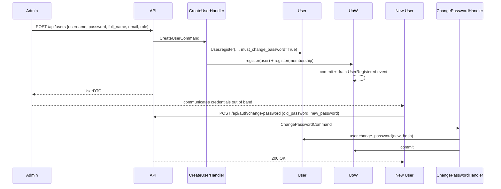

# Admin-Create User Flow (Hexagonal Lift)

## Goal
Admin creates a user account with a temporary password. User logs in and changes password. No email token/invite lifecycle needed.

## Current state to change

- `POST /api/users` in [`api/identity_routers.py`](backend/src/api/identity_routers.py) creates users directly with `User(...)`, bypassing the UoW and domain events
- No proper change-own-password endpoint exists (only `User.change_password()` on the entity)
- `Invite` entity and its commands can be **kept but deprioritised** (may still be useful for external invitations later)

## Proposed flow

## Files to change

### 1. `domain/entities/user.py`
Add `must_change_password: bool = False` field. Update `User.register()` to accept and store it. No new events needed — `UserRegistered` is sufficient.

### 2. `application/commands/create_user.py` (new file)
Extract logic from `identity_routers.py::create_user` into a proper command handler:
- `CreateUserCommand(username, email, full_name, password, role_code, is_outsourced, tenant_id, created_by_user_id)`
- `CreateUserHandler.execute()`: check duplicates, `User.register(must_change_password=True)`, `MembershipService.ensure_membership`, UoW commit

### 3. `application/commands/change_password.py` (new file)
- `ChangePasswordCommand(user_id, old_password, new_password)`
- `ChangePasswordHandler.execute()`: verify old password, hash new password, `user.change_password(new_hash)`, clear `must_change_password`, UoW commit

### 4. `api/identity_routers.py`
Replace the inline `create_user` logic with a call to `CreateUserHandler`. Wire dependencies via FastAPI `Depends`.

### 5. `api/auth.py`
Add `POST /auth/change-password` endpoint wired to `ChangePasswordHandler`. Requires authenticated user (any role).

### 6. `schemas/reference.py`
Add `must_change_password: bool` to `UserResponse` / `UserListResponse` so the frontend can redirect to password-change screen.

### 7. `application/dto.py`
Add `must_change_password: bool` to `UserDTO` and `user_to_dto()`.

## What stays the same
- `Invite` entity, `InviteUserHandler`, `AcceptInviteHandler` — unchanged, kept for potential future external invite flows
- Bootstrap `POST /auth/register` (first admin only) — unchanged
- `RegisterTenantHandler` — unchanged
