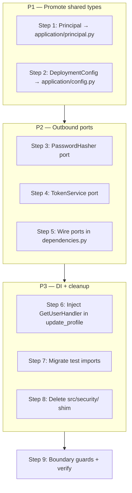

# Fix Application Layer Purity (Post–DDD Gap Follow-ups)

## Overview

The [fix_hex_ddd_gaps plan](fix_hex_ddd_gaps_f9a3c821.plan.md) closed the eight original architecture gaps. Four polish items remain:

| # | Gap | Root cause |
|---|-----|------------|
| 1 | Application imports `infrastructure.security` | No ports for password hashing / JWT; `Principal` lives in infra |
| 2 | Application imports `infrastructure.settings` | `get_settings()` called inside handlers instead of DI |
| 3 | `update_profile` builds `GetUserHandler` inline | Handler not injected like other query paths |
| 4 | Tests + `src/security/` shim | Legacy import path kept for backward compat |

This plan resolves all four in dependency order. No HTTP contract changes.



---

## Current leak inventory

Run before starting; re-run after each step to confirm progress:

```bash
rg "from src\.infrastructure" backend/src/application
rg "from src\.security" backend/tests
ls backend/src/security 2>/dev/null || echo "shim gone"
```

| File | Current import | Fix |
|------|----------------|-----|
| `application/commands/register_tenant.py` | `hash_password` from infra security | `PasswordHasher` port |
| `application/commands/accept_invite.py` | same | same |
| `application/services/auth_application_service.py` | `hash_password`, JWT fns, `get_settings` | `PasswordHasher`, `TokenService`, `DeploymentConfig` |
| `application/commands/ensure_default_tenant.py` | `get_settings` | inject `tenant_instance_id` |
| `application/services/authorization_service.py` | `Principal` from infra | `application.principal` |
| `application/commands/invite_user.py` | `Principal` from infra | same |
| `application/commands/suspend_tenant.py` | `Principal` from infra | same |

---

## Step 1 — Promote `Principal` to the application layer

`Principal` is a pure dataclass (only `domain.enums`); commands and `AuthorizationService` depend on it. It belongs in application, not infrastructure.

### Create `backend/src/application/principal.py`

Move the class verbatim from `infrastructure/security/principal.py`:

```python
from __future__ import annotations

from dataclasses import dataclass, field

from src.domain.enums import UserRole


@dataclass(slots=True)
class Principal:
    user_id: str
    tenant_id: str
    role: UserRole
    email: str
    full_name: str | None = None
    role_ids: list[str] = field(default_factory=list)
    perm_ver: int = 1
    scopes: list[str] = field(default_factory=list)
    permissions: frozenset[str] = field(default_factory=frozenset)
    bearer_token: str | None = None

    @property
    def id(self) -> str:
        return self.user_id

    def has_permission(self, code: str) -> bool:
        ...
```

### Replace `backend/src/infrastructure/security/principal.py`

Thin re-export for inbound adapters (API, FastAPI dependencies):

```python
from src.application.principal import Principal

__all__ = ["Principal"]
```

### Update application import sites

| File | New import |
|------|------------|
| `application/services/authorization_service.py` | `from src.application.principal import Principal` |
| `application/commands/invite_user.py` | same |
| `application/commands/suspend_tenant.py` | same |

`infrastructure/security/dependencies.py` can keep importing `Principal` from its local module (re-export) — no API route changes required.

---

## Step 2 — `DeploymentConfig` (replace `get_settings` in application)

Application code only needs two settings values today:

| Caller | Setting used |
|--------|--------------|
| `EnsureDefaultTenantHandler` | `tenant_instance_id` |
| `AuthApplicationService._issue_login` | `jwt_expire_minutes` |

### Create `backend/src/application/config.py`

```python
from __future__ import annotations

from dataclasses import dataclass


@dataclass(frozen=True, slots=True)
class DeploymentConfig:
    tenant_instance_id: str
    jwt_expire_minutes: int
```

### Inject via constructors

**`EnsureDefaultTenantHandler`** — add `tenant_instance_id: str` to `__init__`; replace `get_settings().tenant_instance_id` with `self._tenant_instance_id`.

**`AuthApplicationService`** — add `jwt_expire_minutes: int` (or accept full `DeploymentConfig`); replace `get_settings()` in `_issue_login`.

**`infrastructure/dependencies.py`** — read settings once at the composition root:

```python
from src.application.config import DeploymentConfig

def _deployment_config() -> DeploymentConfig:
    settings = get_settings()
    return DeploymentConfig(
        tenant_instance_id=settings.tenant_instance_id,
        jwt_expire_minutes=settings.jwt_expire_minutes,
    )

def get_auth_application_service() -> AuthApplicationService:
    cfg = _deployment_config()
    return AuthApplicationService(
        ...
        default_tenant_id=cfg.tenant_instance_id,
        jwt_expire_minutes=cfg.jwt_expire_minutes,
        ...
    )

def get_ensure_default_tenant_handler() -> EnsureDefaultTenantHandler:
    cfg = _deployment_config()
    return EnsureDefaultTenantHandler(
        ...
        tenant_instance_id=cfg.tenant_instance_id,
    )
```

Remove `from src.infrastructure.settings import get_settings` from both application files.

---

## Step 3 — `PasswordHasher` port

### Create `backend/src/application/ports/__init__.py`

```python
from src.application.ports.password_hasher import PasswordHasher
from src.application.ports.token_service import TokenService

__all__ = ["PasswordHasher", "TokenService"]
```

### Create `backend/src/application/ports/password_hasher.py`

```python
from __future__ import annotations

from typing import Protocol


class PasswordHasher(Protocol):
    def hash(self, password: str) -> str: ...
    def verify(self, plain: str, hashed: str) -> bool: ...
```

### Create `backend/src/infrastructure/security/password_hasher.py`

Adapter wrapping existing bcrypt functions:

```python
from src.application.ports.password_hasher import PasswordHasher
from src.infrastructure.security.security import hash_password, verify_password


class BcryptPasswordHasher:
    def hash(self, password: str) -> str:
        return hash_password(password)

    def verify(self, plain: str, hashed: str) -> bool:
        return verify_password(plain, hashed)
```

### Wire in `dependencies.py`

```python
@lru_cache
def get_password_hasher() -> PasswordHasher:
    from src.infrastructure.security.password_hasher import BcryptPasswordHasher
    return BcryptPasswordHasher()
```

### Update application callers

| File | Change |
|------|--------|
| `register_tenant.py` | Add `password_hasher: PasswordHasher`; use `self.password_hasher.hash(...)` |
| `accept_invite.py` | Add `password_hasher: PasswordHasher` to handler |
| `auth_application_service.py` | Add `password_hasher: PasswordHasher`; use for register/login |

Remove all `from src.infrastructure.security.security import hash_password` from application.

---

## Step 4 — `TokenService` port

`AuthApplicationService` is the only application caller of JWT helpers.

### Create `backend/src/application/ports/token_service.py`

```python
from __future__ import annotations

from typing import Protocol


class TokenService(Protocol):
    def create_access_token(
        self,
        subject: str,
        email: str,
        role: str,
        *,
        tenant_id: str,
        role_ids: list[str] | None = None,
        perm_ver: int = 1,
        scopes: list[str] | None = None,
    ) -> str: ...

    def create_refresh_token(self, subject: str, *, tenant_id: str) -> str: ...

    def decode_refresh_token(self, token: str) -> dict: ...
```

### Create `backend/src/infrastructure/security/jwt_token_service.py`

Delegate to existing functions; translate `SecurityError` to `InvalidToken` at the adapter boundary so application never imports infra exception types:

```python
from src.application.ports.token_service import TokenService
from src.domain.exceptions import InvalidToken
from src.infrastructure.security.security import (
    SecurityError,
    create_access_token,
    create_refresh_token,
    decode_refresh_token,
)


class JwtTokenService:
    def create_access_token(self, ...) -> str:
        return create_access_token(...)

    def create_refresh_token(self, subject: str, *, tenant_id: str) -> str:
        return create_refresh_token(subject, tenant_id=tenant_id)

    def decode_refresh_token(self, token: str) -> dict:
        try:
            return decode_refresh_token(token)
        except SecurityError as exc:
            raise InvalidToken() from exc
```

### Update `AuthApplicationService`

- Add `token_service: TokenService` to the dataclass.
- Replace direct JWT function calls in `_issue_login` and `refresh`.
- In `refresh`, remove `except SecurityError` — adapter already maps to `InvalidToken`.

Wire in `dependencies.py`:

```python
@lru_cache
def get_token_service() -> TokenService:
    from src.infrastructure.security.jwt_token_service import JwtTokenService
    return JwtTokenService()
```

---

## Step 5 — Inject `GetUserHandler` in `update_profile`

Today `update_profile` constructs a handler inline (lines 232–241 of `auth_application_service.py`). Match the pattern used by API routes.

### Update `AuthApplicationService`

```python
from src.application.queries.user_queries import GetUserHandler, GetUserQuery

@dataclass
class AuthApplicationService:
    ...
    get_user_handler: GetUserHandler

    async def update_profile(self, user: User, payload: ProfileUpdate) -> UserResponse:
        ...
        refreshed = await self.user_repo.find_by_id(user.id)
        return await self.get_user_handler.execute(
            GetUserQuery(user_id=user.id, user=refreshed or user)
        )
```

### Update `get_auth_application_service()` in `dependencies.py`

```python
return AuthApplicationService(
    ...
    get_user_handler=get_get_user_handler(),
    ...
)
```

**Note:** `get_get_user_handler()` is not `@lru_cache` today — that is fine; handler construction is cheap (repo singletons). Optionally add `@lru_cache` to query handler factories for consistency.

---

## Step 6 — Migrate test imports off `src.security`

Three test files still import the shim path:

| File | Replacements |
|------|--------------|
| `tests/test_identity_jwt_contract.py` | `src.infrastructure.security.jwt_keys`, `.security` |
| `tests/test_tenant_foundation.py` | `src.infrastructure.security.security` |
| `tests/test_phase3_rbac.py` | `src.infrastructure.security.principal`, `.security`, `.dependencies`, `.rate_limit` |

For `Principal` in tests, prefer `from src.application.principal import Principal` (canonical) or `from src.infrastructure.security.principal import Principal` (re-export) — either works after Step 1.

Run:

```bash
rg "from src\.security" backend/tests
# expect zero matches
```

---

## Step 7 — Delete `backend/src/security/` shim

After Step 6, no in-repo callers should reference `src.security`.

### Delete directory

```
backend/src/security/__init__.py
backend/src/security/dependencies.py
backend/src/security/jwt_keys.py
backend/src/security/principal.py
backend/src/security/rate_limit.py
backend/src/security/security.py
backend/src/security/security_schemes.py
```

### Update `modules/identity/security/__init__.py`

Already re-exports from `infrastructure.security` — no change needed unless it referenced `src.security`.

### Repo-wide verification

```bash
rg "src\.security" backend/
rg "src/security" docs/
```

If external services still import `src.security`, document the breaking change in ADR-003 or add a one-release deprecation window. Within this repo, deletion is safe after test migration.

---

## Step 8 — Tighten boundary guards

### Extend `backend/tests/test_phase1_boundaries.py`

Replace the narrow persistence-only guard with a full infrastructure ban:

```python
FORBIDDEN_APPLICATION_IMPORTS = (
    "fastapi",
    "beanie",
    "motor",
    "redis",
    "infrastructure",  # catches security, settings, persistence, messaging, etc.
)
```

Add shim removal guard (mirror `test_models_shim_directory_removed`):

```python
def test_security_shim_directory_removed(self) -> None:
    self.assertFalse(
        (BACKEND_ROOT / "src" / "security").exists(),
        msg="backend/src/security/ shim must not exist; use infrastructure/security/",
    )
```

Existing `test_no_framework_imports_in_application` already loops over `FORBIDDEN_APPLICATION_IMPORTS` — updating the tuple is sufficient.

---

## Step 9 — Verify: docs + pytest

### Update `docs/architecture/adr/003-hexagonal-architecture.md`

Add to **Consequences**:

> - Positive: Application layer has zero `infrastructure.*` imports; auth crypto and deployment config are injected via `application/ports/` and `application/config.py`.
> - Positive: `Principal` lives in `application/principal.py`; JWT/password adapters remain in `infrastructure/security/`.
> - Negative: `backend/src/security/` compatibility shim removed; callers must use `infrastructure.security` or `application.principal`.

### Verification commands

```bash
cd backend

# Zero infra imports in application
rg "from src\.infrastructure" src/application
# expect zero matches

# Zero security shim references
rg "src\.security" .

# Full suite
poetry run pytest -q
```

---

## Files changed (summary)

| Action | Files |
|--------|-------|
| Create | `application/principal.py`, `application/config.py`, `application/ports/__init__.py`, `application/ports/password_hasher.py`, `application/ports/token_service.py`, `infrastructure/security/password_hasher.py`, `infrastructure/security/jwt_token_service.py` |
| Edit | `application/commands/register_tenant.py`, `accept_invite.py`, `ensure_default_tenant.py`, `invite_user.py`, `suspend_tenant.py`, `application/services/auth_application_service.py`, `authorization_service.py`, `infrastructure/dependencies.py`, `infrastructure/security/principal.py`, `tests/test_phase1_boundaries.py`, `tests/test_identity_jwt_contract.py`, `tests/test_tenant_foundation.py`, `tests/test_phase3_rbac.py`, `docs/architecture/adr/003-hexagonal-architecture.md` |
| Delete | `backend/src/security/` (entire directory) |

---

## Risk notes

- **No API contract change.** HTTP status codes and response shapes unchanged.
- **Principal move is source-compatible** for API routes if `infrastructure/security/principal.py` keeps re-exporting.
- **TokenService adapter maps `SecurityError` → `InvalidToken`** — same HTTP 401 as today via `main.py` domain handler.
- **Incremental delivery** — Steps 1–2 (types + config) can merge alone; Steps 3–4 (ports) as a second PR; Steps 5–8 (DI + cleanup) as a third. Step 9 gates all three.
- **Optional follow-up (out of scope):** promote `Principal` usage in API routes to import from `application.principal` directly; add `@lru_cache` to query handler factories.

---

## Acceptance criteria

- [ ] `rg "from src\.infrastructure" backend/src/application` returns no matches
- [ ] `rg "from src\.security" backend/` returns no matches
- [ ] `backend/src/security/` directory does not exist
- [ ] `test_no_framework_imports_in_application` passes with broad `infrastructure` ban
- [ ] `test_security_shim_directory_removed` passes
- [ ] Full pytest suite green (`35+` tests)
- [ ] ADR-003 updated
