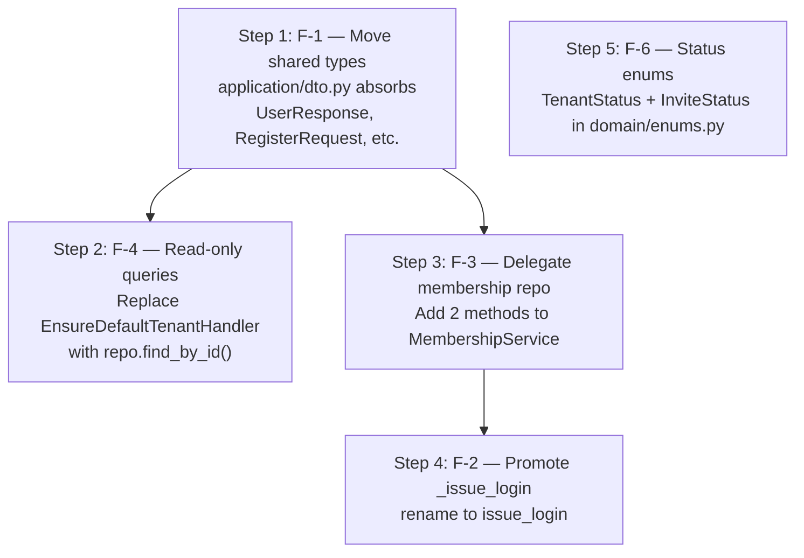

# Fix Architectural Boundary Gaps

## Overview

Five targeted fixes, executed in dependency order. Steps 1–4 each touch overlapping files (`application/dto.py`, `auth_application_service.py`); step 5 is fully independent.



---

## Step 1 — F-1: Move shared types out of `schemas/auth.py` into `application/dto.py`

### Why

Four application-layer files import from `src.schemas.auth` (the HTTP adapter layer):

- [`backend/src/application/dto.py`](backend/src/application/dto.py) — imports `PhoneResponse, UserResponse`
- [`backend/src/application/services/auth_application_service.py`](backend/src/application/services/auth_application_service.py) — imports `ForgotPasswordRequest, ForgotPasswordResponse, LoginRequest, ProfileUpdate, RegisterRequest, UserResponse`
- [`backend/src/application/commands/register_tenant.py`](backend/src/application/commands/register_tenant.py) — imports `UserResponse`
- [`backend/src/application/queries/user_queries.py`](backend/src/application/queries/user_queries.py) — imports `UserResponse`

The arrow must point outward: API layer → Application layer, never the reverse.

### Change 1a — `backend/src/application/dto.py`

Add these Pydantic models directly to `dto.py`, then remove the `from src.schemas.auth import` line. The `LoginResult`, `InviteResult`, `TenantResult` dataclasses and `user_to_response()` stay unchanged.

Types to define here — with naming adjusted to remove HTTP semantics from the application layer:

- `PhoneDTO` (renamed from `PhoneResponse`) — the name `Response` implies an HTTP reply; the application layer knows only data transfer, not HTTP verbs. This is the only rename in this step; `UserResponse` keeps its name for now since it is the most widely used type and renaming it is a larger refactor (all routers, tests, and OpenAPI schema would change). That rename is noted as future work.
- `UserResponse` — returned by app services and query handlers
- `RegisterRequest` — app service input
- `LoginRequest` — app service input
- `ProfileUpdate` — app service input
- `ForgotPasswordRequest` / `ForgotPasswordResponse` — app service input/output

`OAuth2TokenResponse` and `LoginResponse` (OAuth2 and HTTP wire formats) stay in `schemas/auth.py`.

### Change 1b — `backend/src/schemas/auth.py`

Replace the definitions of the moved types with re-exports. Keep `PhoneResponse` as a named alias so existing router and test imports require no changes:

```python
from src.application.dto import (
    PhoneDTO,
    UserResponse,
    RegisterRequest,
    LoginRequest,
    ProfileUpdate,
    ForgotPasswordRequest,
    ForgotPasswordResponse,
)

# HTTP-layer alias — routers and OpenAPI schema continue to see PhoneResponse
PhoneResponse = PhoneDTO
```

### Change 1c — Application layer: drop `from src.schemas.auth import …`

| File | Remove | Replace with |
| --- | --- | --- |
| `application/dto.py` | `from src.schemas.auth import PhoneResponse, UserResponse` | define both inline; use `PhoneDTO` internally |
| `application/services/auth_application_service.py` | `from src.schemas.auth import (...)` | `from src.application.dto import ...` |
| `application/commands/register_tenant.py` | `from src.schemas.auth import UserResponse` | `from src.application.dto import UserResponse` |
| `application/queries/user_queries.py` | `from src.schemas.auth import UserResponse` | `from src.application.dto import UserResponse` |

Inside `application/dto.py`, the `user_to_response()` helper currently builds a `PhoneResponse(...)`; change that to `PhoneDTO(...)`.

### Verification

```bash
rg "from src.schemas.auth" backend/src/application/ --type py
# expect zero matches
```

---

## Step 2 — F-4: Remove write side-effects from query handlers

### Why

[`backend/src/application/queries/user_queries.py`](backend/src/application/queries/user_queries.py) contains `_active_membership()` (lines 18–47) which instantiates and executes `EnsureDefaultTenantHandler` — a command that writes a `Tenant` row to MongoDB. Queries must be side-effect-free.

Since [`backend/src/main.py`](backend/src/main.py) calls `await ensure_default_tenant()` at startup (lifespan), the default tenant is guaranteed to exist whenever a query handler runs.

### Change — `backend/src/application/queries/user_queries.py`

Replace the `EnsureDefaultTenantHandler` instantiation inside `_active_membership()` with a direct read:

```python
# Before
from src.application.commands.ensure_default_tenant import EnsureDefaultTenantHandler

tenant = await EnsureDefaultTenantHandler(
    tenant_repo, authz, membership_service.publisher,
    tenant_instance_id=tenant_instance_id,
).execute()

# After — read-only, no side effects
from src.domain.exceptions import TenantNotFound

tenant = await tenant_repo.find_by_id(tenant_instance_id)
if tenant is None:
    raise TenantNotFound()
```

The `ensure_membership()` call in the same helper (line 37–42) should also be evaluated: it writes a `Membership` row on first `GET /me`. If that intent is to be preserved as lazy bootstrap, move it into the startup lifespan instead and remove it from the query. If the intent is strict CQRS, remove it from the query entirely (the membership must be created at login/accept-invite time, not on GET). The plan removes it from queries and treats missing membership as `MembershipInactive`.

### Verification

```bash
rg "EnsureDefaultTenantHandler" backend/src/application/queries/ --type py
# expect zero matches
```

---

## Step 3 — F-3: Add delegation methods to `MembershipService`

### Why

[`backend/src/application/services/auth_application_service.py`](backend/src/application/services/auth_application_service.py) reaches through `MembershipService`'s boundary at two points:

- Line 77: `self.membership_service.membership_repo.find_active_by_user(user.id)`
- Lines 190–193: `self.membership_service.membership_repo.find_by_tenant_and_user(tenant_id, user_id)`

### Change 3a — `backend/src/application/services/membership_service.py`

Add two delegation methods:

```python
async def find_active_for_user(self, user_id: str) -> Membership | None:
    return await self.membership_repo.find_active_by_user(user_id)

async def find_for_tenant_and_user(
    self, tenant_id: str, user_id: str
) -> Membership | None:
    return await self.membership_repo.find_by_tenant_and_user(tenant_id, user_id)
```

### Change 3b — `backend/src/application/services/auth_application_service.py`

Replace the direct repo accesses:

```python
# _active_membership (line 77)
# Before
membership = await self.membership_service.membership_repo.find_active_by_user(user.id)
# After
membership = await self.membership_service.find_active_for_user(user.id)

# refresh() (lines 190–193)
# Before
membership = await self.membership_service.membership_repo.find_by_tenant_and_user(
    tenant_id, user_id
)
# After
membership = await self.membership_service.find_for_tenant_and_user(tenant_id, user_id)
```

---

## Step 4 — F-2: Promote `_issue_login` to public

### Why

[`backend/src/application/commands/register_tenant.py`](backend/src/application/commands/register_tenant.py) line 108 calls `self.auth_app._issue_login(user, membership, tenant)`, coupling it to an internal implementation detail. Prefixed methods are semantically private; cross-type calls on them break encapsulation.

The deeper issue is that `RegisterTenantHandler` depends on `AuthApplicationService` solely to issue a token — it does not need the rest of the service. A future refactor would extract a dedicated `LoginIssuer` or `TokenIssuanceService` that encapsulates JWT creation, permission resolution, and refresh-token generation. Both `RegisterTenantHandler` and `AuthApplicationService` would depend on that narrower collaborator instead. That refactor is out of scope here; the immediate fix is to make the method public so the cross-type call is not reaching into a private API.

### Change 4a — `backend/src/application/services/auth_application_service.py`

Rename `_issue_login` → `issue_login`. No logic change.

### Change 4b — `backend/src/application/commands/register_tenant.py`

```python
# Before
login: LoginResult = await self.auth_app._issue_login(user, membership, tenant)
# After
login: LoginResult = await self.auth_app.issue_login(user, membership, tenant)
```

### Verification

```bash
rg "_issue_login" backend/src/ --type py
# expect zero matches
```

---

## Step 5 — F-6: Replace string status fields with enums

### Why

`Tenant.status: str` and `Invite.status: str` use magic string comparisons throughout their methods (`"active"`, `"suspended"`, `"pending"`, `"accepted"`, `"revoked"`, `"expired"`). Because both enums extend `str`, MongoDB and Pydantic serialisation are unaffected — the on-wire and stored values stay identical.

### Change 5a — `backend/src/domain/enums.py`

```python
class TenantStatus(str, Enum):
    ACTIVE = "active"
    SUSPENDED = "suspended"

class InviteStatus(str, Enum):
    PENDING = "pending"
    ACCEPTED = "accepted"
    REVOKED = "revoked"
    EXPIRED = "expired"
```

### Change 5b — `backend/src/domain/entities/tenant.py`

```python
from src.domain.enums import TenantStatus

@dataclass
class Tenant(AggregateRoot):
    ...
    status: TenantStatus = TenantStatus.ACTIVE

    def suspend(self) -> None:
        if self.status == TenantStatus.SUSPENDED:
            raise TenantAlreadySuspended()
        self.status = TenantStatus.SUSPENDED
        ...

    def activate(self, ...) -> None:
        if self.status == TenantStatus.ACTIVE and self.is_active:
            return
        self.status = TenantStatus.ACTIVE
        ...

    @property
    def is_suspended(self) -> bool:
        return self.status == TenantStatus.SUSPENDED or not self.is_active
```

### Change 5c — `backend/src/domain/entities/invite.py`

```python
from src.domain.enums import InviteStatus

@dataclass
class Invite(AggregateRoot):
    ...
    status: InviteStatus = InviteStatus.PENDING

    def accept(self) -> None:
        if self.status != InviteStatus.PENDING:
            raise InviteNotPending()
        ...
        self.status = InviteStatus.ACCEPTED
        ...

    def revoke(self) -> None:
        self.status = InviteStatus.REVOKED

    def expire(self) -> None:
        self.status = InviteStatus.EXPIRED

    @property
    def is_pending(self) -> bool:
        return self.status == InviteStatus.PENDING
```

### Change 5d — Mappers and constructors

The `TenantMapper.to_domain()` and `InviteMapper.to_domain()` in [`backend/src/infrastructure/persistence/mongo/mappers/__init__.py`](backend/src/infrastructure/persistence/mongo/mappers/__init__.py) pass `status=doc.status` (a plain string from MongoDB). Since `TenantStatus(str, Enum)` and `InviteStatus(str, Enum)` accept string construction, no mapper change is strictly required — but explicitly wrapping `status=TenantStatus(doc.status)` makes the coercion clear.

Any `Tenant(status="active")` or `Invite(status="pending")` calls in command handlers (e.g. `register_tenant.py`, `ensure_default_tenant.py`) must be updated to use the enum constants.

---

## Files Changed (summary)

| Action | Files |
| --- | --- |
| Edit (F-1) | `application/dto.py`, `schemas/auth.py`, `application/services/auth_application_service.py`, `application/commands/register_tenant.py`, `application/queries/user_queries.py` |
| Edit (F-4) | `application/queries/user_queries.py` |
| Edit (F-3) | `application/services/membership_service.py`, `application/services/auth_application_service.py` |
| Edit (F-2) | `application/services/auth_application_service.py`, `application/commands/register_tenant.py` |
| Edit (F-6) | `domain/enums.py`, `domain/entities/tenant.py`, `domain/entities/invite.py`, `infrastructure/persistence/mongo/mappers/__init__.py`, `application/commands/register_tenant.py`, `application/commands/ensure_default_tenant.py`, `application/commands/suspend_tenant.py` |

## Risk notes

- No API contract change — HTTP shapes, status codes, and stored MongoDB values are all unchanged.
- F-1 is the widest touch but `schemas/auth.py` re-exports keep all API-layer imports working without changes to routers. The only rename is `PhoneResponse` → `PhoneDTO` inside `application/`; the `PhoneResponse = PhoneDTO` alias in `schemas/auth.py` keeps all external references stable.
- F-6 is safe because `TenantStatus` and `InviteStatus` extend `str` — Pydantic, Beanie, and JSON serialisation all see plain strings.
- Steps are independent and can be delivered as one or multiple PRs; suggested order: 1 → 2+3+4 together → 5.

---

## Future work (out of scope for this plan)

- **`UserResponse` → `UserDTO` rename** — follows the same rationale as `PhoneDTO` but touches every router, test, and OpenAPI doc comment. Defer to a dedicated rename PR.
- **`AuthApplicationService` decomposition** — the service currently owns Register, Login, Refresh, ForgotPassword, Profile, and token issuance (`issue_login`). It already violates SRP. A follow-up plan should extract `LoginIssuer` (or `TokenIssuanceService`) to hold `issue_login`, `create_access_token` orchestration, and refresh logic. Once extracted, `RegisterTenantHandler` depends on `LoginIssuer` directly instead of `AuthApplicationService`. Further decomposition into `RegistrationService`, `ProfileService`, and `PasswordService` follows naturally.
- **Transactional Outbox / Unit of Work** — prerequisite for F-5 (aggregate event collection). Not in scope until a formal outbox or UoW is introduced.
