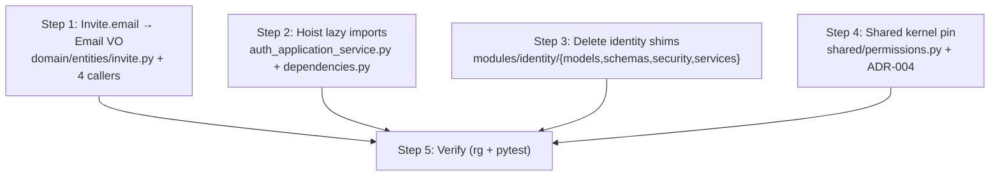

# Fix DDD Polish Items

## Overview

Four small follow-ups from the post-refactor hexagonal/DDD review, in priority order:

| # | Gap | Risk | Effort |
|---|-----|------|--------|
| 1 | `Invite.email` is `str`, not `Email` VO | Inconsistency; validation gap | Low (7 call sites) |
| 2 | Lazy imports hide `AuthApplicationService` dependencies | Readability; inline construction leaks DI discipline | Low |
| 3 | `modules/identity/{models,schemas,security,services}` shims | Dead indirection, confusion about canonical paths | Low |
| 4 | `shared/permissions.py` has no sync tracking | Drift risk across services | Negligible (doc + pin only) |

None of these carry API contract risk. Steps are independent and can be delivered separately.



---

## Step 1 — `Invite.email: str` → `Email` VO

### Why

`User.email` was already upgraded to the `Email` value object in the `fix_hex_ddd_gaps` plan.
`Invite.email` was left as `str`, creating an inconsistency: an invite email passes no
validation beyond what FastAPI's `EmailStr` field does at the API boundary, while user emails
are validated and normalised at the domain level.

### Change 1a — `backend/src/domain/entities/invite.py`

```python
# Before
from __future__ import annotations
...
@dataclass
class Invite(AggregateRoot):
    ...
    email: str

    @classmethod
    def create(cls, *, ..., email: str, ...) -> Invite:
        return cls(
            ...
            email=email.lower(),   # manual normalisation
            ...
        )

# After
from src.domain.value_objects.email import Email
...
@dataclass
class Invite(AggregateRoot):
    ...
    email: Email

    @classmethod
    def create(cls, *, ..., email: str, ...) -> Invite:
        return cls(
            ...
            email=Email(email),    # VO validates + normalises (lower-cases internally)
            ...
        )
```

The `create()` factory retains `email: str` as its parameter so callers at the command
boundary (which receive raw strings from the HTTP layer) need no changes.

### Change 1b — `backend/src/infrastructure/persistence/mongo/mappers/__init__.py`

In `InviteMapper`:

```python
# to_domain — wrap stored string
email=Email(doc.email),

# to_document — unwrap to string for storage
"email": str(entity.email),          # or entity.email.value
```

### Change 1c — `backend/src/application/commands/accept_invite.py`

Two sites change:

| Old | New |
|-----|-----|
| `await self._user_repo.find_by_email(invite.email)` | `await self._user_repo.find_by_email(str(invite.email))` |
| `email=Email(invite.email)` when constructing `User` | `email=invite.email` (already an `Email`) |

### Change 1d — `backend/src/application/commands/invite_user.py`

Two sites change (both pass `invite.email` to non-`Email` receivers):

```python
# InviteCreated event — field is str
email=str(invite.email),

# audit detail dict — must be JSON-serialisable str
detail={"email": str(invite.email), "role_code": invite.role_code},
```

### Change 1e — `backend/src/modules/identity/api/tenants.py`

`InviteResponse.email` is Pydantic `EmailStr`, which accepts a plain string:

```python
# In _invite_response()
email=str(invite.email),   # was invite.email
```

### Verification

```bash
rg "invite\.email" backend/src --type py
# All hits should be either:
#   str(invite.email)  — passing to str receiver
#   invite.email       — passing to Email receiver or as domain Email
# No bare .email used as str without explicit str()
```

---

## Step 2 — Hoist lazy imports in `AuthApplicationService`

### Why

Three imports are deferred inside method bodies:

| Import | Method | Reason for deferral | Actual circular risk? |
|--------|---------|--------------------|-----------------------|
| `from src.domain.value_objects.phone import Phone` | `register()`, `update_profile()` | None identified | **No** — `domain/` never imports `application/` |
| `from src.domain.entities.auth_event import AuthEvent` | `_record_event()` | None identified | **No** — same reason |
| `from src.application.commands.ensure_default_tenant import EnsureDefaultTenantHandler` | `_ensure_default_tenant()` | Avoids circular import and inline construction | **No** — `ensure_default_tenant.py` does not import `auth_application_service.py` |

The deferred imports hide what `AuthApplicationService` depends on and the inline construction
of `EnsureDefaultTenantHandler` breaks the DI discipline that every other handler follows.

### Change 2a — `backend/src/application/services/auth_application_service.py`

**Add top-level imports** (remove from method bodies):

```python
from src.application.commands.ensure_default_tenant import EnsureDefaultTenantHandler
from src.domain.entities.auth_event import AuthEvent
from src.domain.value_objects.phone import Phone
```

**Add field to the dataclass**:

```python
@dataclass
class AuthApplicationService:
    ...
    get_user_handler: GetUserHandler
    ensure_default_tenant_handler: EnsureDefaultTenantHandler   # add this
```

**Replace `_ensure_default_tenant()` body**:

```python
async def _ensure_default_tenant(self) -> Tenant:
    return await self.ensure_default_tenant_handler.execute()
```

Remove the inline construction of `EnsureDefaultTenantHandler` entirely.

**In `register()`** — remove inner `from src.domain.value_objects.phone import Phone` (now at top).

**In `update_profile()`** — remove inner `from src.domain.value_objects.phone import Phone` (now at top).

**In `_record_event()`** — remove inner `from src.domain.entities.auth_event import AuthEvent` (now at top).

### Change 2b — `backend/src/infrastructure/dependencies.py`

Wire the new field in `get_auth_application_service()`:

```python
def get_auth_application_service() -> AuthApplicationService:
    cfg = _deployment_config()
    return AuthApplicationService(
        ...
        get_user_handler=get_get_user_handler(),
        ensure_default_tenant_handler=get_ensure_default_tenant_handler(),   # add
    )
```

`get_ensure_default_tenant_handler()` already exists in `dependencies.py` and has no circular
dependency on `get_auth_application_service()`, so this is safe.

### Verification

```bash
rg "^    from src\." backend/src/application/services/auth_application_service.py
# expect zero matches (no remaining indented imports)
```

---

## Step 3 — Delete `modules/identity/` compatibility shims

### Why

The `modules/identity/` sub-package was introduced during the Strangler Fig migration to give
legacy callers a stable import path while the canonical paths were being built. Today:

| File | Purpose | External callers |
|------|---------|-----------------|
| `modules/identity/api/tenants.py` | **Live implementation** — the actual tenant router | `api/identity_routers.py` (direct import) |
| `modules/identity/api/__init__.py` | Re-exports `tenants_router` | None outside the module |
| `modules/identity/models/__init__.py` | Re-exports infra documents as legacy names | **None** |
| `modules/identity/schemas/__init__.py` | Re-exports `schemas.auth` types | **None** |
| `modules/identity/security/__init__.py` | Re-exports infra security helpers + raw `hash_password` | **None** |
| `modules/identity/services/__init__.py` | Re-exports `AuthService` alias | **None** |
| `modules/identity/__init__.py` | Eagerly imports all sub-packages | Only self-referential |

Verified with: `rg "from src\.modules\.identity" --type py backend/`
— the only hit outside the `modules/` tree is `api/identity_routers.py` importing from
`modules.identity.api.tenants` (the live implementation), not from any shim.

### Files to delete

```
backend/src/modules/identity/models/__init__.py
backend/src/modules/identity/schemas/__init__.py
backend/src/modules/identity/security/__init__.py
backend/src/modules/identity/services/__init__.py
```

### Files to edit

**`backend/src/modules/identity/__init__.py`** — replace the eager import block with an empty
`# Identity module — api/tenants.py is the live router; other sub-packages removed.` comment,
or delete it entirely (Python doesn't require `__init__.py` for namespace packages).

**`backend/src/modules/identity/api/__init__.py`** — optionally remove the `tenants_router`
re-export since the only real consumer (`identity_routers.py`) already imports from
`modules.identity.api.tenants` directly. If kept, it is harmless.

### Boundary test addition

In `backend/tests/test_phase1_boundaries.py`, add:

```python
MODULES_IDENTITY_DIR = BACKEND_ROOT / "src" / "modules" / "identity"

FORBIDDEN_SHIM_INIT_FILES = (
    MODULES_IDENTITY_DIR / "models" / "__init__.py",
    MODULES_IDENTITY_DIR / "schemas" / "__init__.py",
    MODULES_IDENTITY_DIR / "security" / "__init__.py",
    MODULES_IDENTITY_DIR / "services" / "__init__.py",
)

def test_identity_module_shims_removed(self) -> None:
    for path in FORBIDDEN_SHIM_INIT_FILES:
        self.assertFalse(
            path.exists(),
            msg=f"legacy shim {path.relative_to(BACKEND_ROOT)} must not exist; "
                f"use canonical application/ or infrastructure/ paths",
        )
```

### Note

`modules/identity/api/tenants.py` stays. A future optional follow-up would move
`tenants.py` directly to `src/api/tenants.py`, eliminating the `modules/` nesting
entirely — but that rename is out of scope here.

---

## Step 4 — Document `shared/permissions.py` shared-kernel sync obligation

### Why

`shared/permissions.py` carries the full multi-service permission catalog (identity + tracking
codes). The file header acknowledges it must be kept in sync with
`pacific-equipment-tracking/backend/src/shared/permissions.py` via manual sync until a shared
Python package exists. Without any machine-readable marker, drift is invisible.

### Change 4a — Add a version pin to `backend/src/shared/permissions.py`

Add at the top, just after the module docstring:

```python
# Shared-kernel version — update this string whenever the catalog changes,
# then copy this file to pacific-equipment-tracking repo and update its pin too.
# See ADR-004 for the planned path to a proper shared package.
SHARED_KERNEL_VERSION: str = "2026-07-23"   # ISO date of last sync
```

This makes the sync timestamp visible in code review diffs and searchable across repos.

### Change 4b — Create `docs/architecture/adr/004-shared-permissions-kernel.md`

```markdown
# ADR-004: Shared Permission Catalog as Manual Shared Kernel

## Status
Accepted (interim)

## Context
The permission catalog (`tracking.*`, `identity.*`, …) must be consistent across
`pacific-identity-platform` and `pacific-equipment-tracking` so that JWTs issued by Identity
are correctly authorised by Tracking.

## Decision
Maintain `backend/src/shared/permissions.py` in each service as an identical copy — a
*shared kernel* in DDD terms.  Each service owns its copy; changes require a coordinated
update to both services and a bump of `SHARED_KERNEL_VERSION`.

## Sync procedure
1. Edit `shared/permissions.py` in the originating service.
2. Update `SHARED_KERNEL_VERSION` to today's ISO date.
3. Copy the file verbatim to the other service and update its `SHARED_KERNEL_VERSION`.
4. Open PRs in both repos in the same sprint; merge together.

## Consequences
- Negative: Manual coordination; drift is possible if the procedure is skipped.
- Positive: No inter-repo runtime dependency; each service deploys independently.
- Planned migration: Extract to a private `pacific-shared` Python package (Phase 2+).
  Trigger: when a third service needs the catalog, or when manual sync causes a defect.
```

### Optional — boundary test

If you want CI to catch a missing version pin, add to `test_phase1_boundaries.py`:

```python
def test_shared_kernel_version_present(self) -> None:
    from src.shared.permissions import SHARED_KERNEL_VERSION
    self.assertIsInstance(SHARED_KERNEL_VERSION, str)
    self.assertRegex(
        SHARED_KERNEL_VERSION,
        r"^\d{4}-\d{2}-\d{2}$",
        msg="SHARED_KERNEL_VERSION must be an ISO date string (YYYY-MM-DD)",
    )
```

---

## Step 5 — Verify

### Run boundary tests

```bash
cd backend
poetry run pytest tests/test_phase1_boundaries.py -v
```

### Run full suite

```bash
poetry run pytest -q
# expect 36+ tests passing (boundary test additions add ≥2 more)
```

### Spot-check import cleanliness

```bash
# No bare invite.email used as string without str()
rg "invite\.email" backend/src --type py

# No indented imports in auth_application_service
rg "^    from src\." backend/src/application/services/auth_application_service.py

# No shim files
ls backend/src/modules/identity/models/   2>/dev/null || echo "deleted OK"
ls backend/src/modules/identity/schemas/  2>/dev/null || echo "deleted OK"
ls backend/src/modules/identity/security/ 2>/dev/null || echo "deleted OK"
ls backend/src/modules/identity/services/ 2>/dev/null || echo "deleted OK"
```

---

## Files changed (full summary)

| Action | Files |
|--------|-------|
| Edit | `domain/entities/invite.py`, `infrastructure/persistence/mongo/mappers/__init__.py`, `application/commands/accept_invite.py`, `application/commands/invite_user.py`, `modules/identity/api/tenants.py` |
| Edit | `application/services/auth_application_service.py`, `infrastructure/dependencies.py` |
| Delete | `modules/identity/models/__init__.py`, `modules/identity/schemas/__init__.py`, `modules/identity/security/__init__.py`, `modules/identity/services/__init__.py` |
| Edit | `modules/identity/__init__.py` (simplify) |
| Edit | `shared/permissions.py` (add `SHARED_KERNEL_VERSION`) |
| Create | `docs/architecture/adr/004-shared-permissions-kernel.md` |
| Edit | `tests/test_phase1_boundaries.py` (2 new guard tests) |

## Risk notes

- **No API contract change.** HTTP shapes and status codes are unaffected by all four steps.
- **Step 1 is the widest touch** — seven files, but each change is mechanical (str → Email or
  str(Email)). Run `rg "invite\.email"` before and after to confirm no missed sites.
- **Step 2 has no behaviour change** — the handler was always constructed from the same
  dependencies; injection just makes them explicit.
- **Step 3 is safe** — verified zero external callers of the four shim `__init__.py` files.
  If an undiscovered external service imports `src.modules.identity.security`, deletion is a
  breaking change for that consumer. Re-run `rg "modules\.identity\.(models|schemas|security|services)"` across all sibling repos before merging.
- **Step 4 is documentation-only** — zero runtime impact.
- **Incremental delivery** — each step is independently mergeable. Suggested order: 1 → 2 → 3 → 4, but any order is valid since there are no inter-step dependencies.
