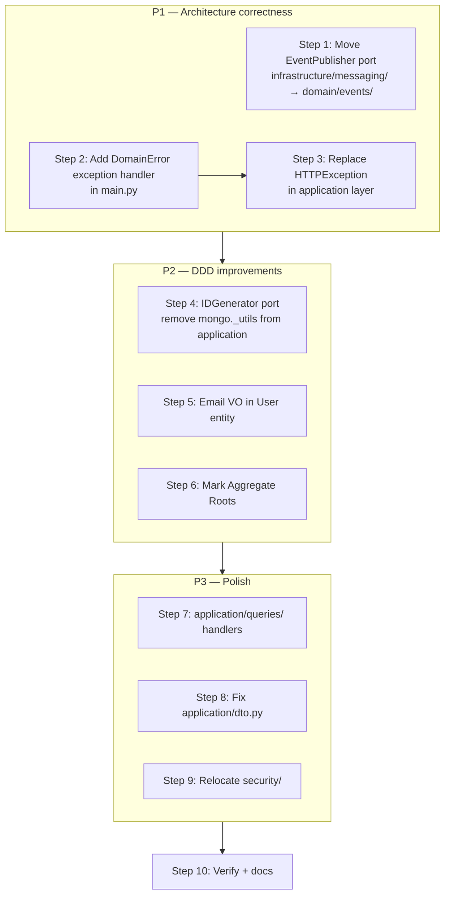

# Fix Hexagonal Architecture & DDD Gaps

## Overview

This plan addresses all gaps from the architecture review in dependency order — each step is
safe to execute independently, but the order below minimises merge conflicts:

1. Move port (EventPublisher) — no behaviour change, only path changes
2. Exception translation infrastructure — add handler before changing raisers
3. Replace HTTPException — depends on step 2
4. IDGenerator port — remove infra leak from application commands
5. Email VO in User — domain purity improvement
6. Aggregate Root markers — annotation/documentation only
7. application/queries/ — CQRS read side
8. Fix application/dto.py — remove last infra import from application layer
9. Relocate security/ — structural rename
10. Verify



---

## Step 1 — Move `EventPublisher` port to `domain/events/`

A port (interface) belongs in the layer that depends on it. Application commands depend on
`EventPublisher`; it must live in `domain/` or `application/`, not `infrastructure/`.

### Create `backend/src/domain/events/publisher.py`

```python
from __future__ import annotations

from abc import ABC, abstractmethod

from src.domain.events.base import DomainEvent


class EventPublisher(ABC):
    @abstractmethod
    async def publish(self, event: DomainEvent) -> None: ...
```

### Update `backend/src/infrastructure/messaging/event_publisher.py`

Replace the `EventPublisher` ABC definition with an import; keep both concrete classes:

```python
from src.domain.events.publisher import EventPublisher  # port lives in domain now

# InProcessEventPublisher and CompositeEventPublisher remain here unchanged
```

### Update all import sites

| File | Change |
|------|--------|
| `application/commands/*.py` | `from src.domain.events.publisher import EventPublisher` |
| `application/services/*.py` | same |
| `infrastructure/dependencies.py` | `from src.domain.events.publisher import EventPublisher` |

Run `rg "from src.infrastructure.messaging.event_publisher import EventPublisher"` to find all sites.

---

## Step 2 — Add `DomainError` exception handler in `main.py`

Before changing the application layer, wire the translation layer so both paths work simultaneously.

### In `backend/src/main.py`

```python
from fastapi import FastAPI, Request
from fastapi.responses import JSONResponse

from src.domain.exceptions import (
    DomainError,
    DuplicateEmail,
    DuplicateUsername,
    InviteExpired,
    InviteNotFound,
    InviteNotPending,
    RegistrationClosed,
    TenantAlreadySuspended,
    TenantNotSuspended,
    UserInactive,
)

_DOMAIN_STATUS: dict[type[DomainError], int] = {
    DuplicateEmail: 409,
    DuplicateUsername: 409,
    InviteExpired: 410,
    InviteNotFound: 404,
    InviteNotPending: 409,
    RegistrationClosed: 403,
    TenantAlreadySuspended: 409,
    TenantNotSuspended: 409,
    UserInactive: 403,
}


@app.exception_handler(DomainError)
async def domain_error_handler(request: Request, exc: DomainError) -> JSONResponse:
    status_code = _DOMAIN_STATUS.get(type(exc), 400)
    return JSONResponse(status_code=status_code, content={"detail": str(exc) or type(exc).__name__})
```

Register this handler early, before the existing `DuplicateKeyError` handler.

---

## Step 3 — Replace `HTTPException` in the application layer

Once step 2 is in place, sweep the application layer and replace every `HTTPException` raise.
Application code must only raise domain exceptions or let infrastructure exceptions propagate
to the generic handler.

### `backend/src/application/commands/register_tenant.py`

| Old | New |
|-----|-----|
| `raise HTTPException(status_code=409, detail="Tenant slug already exists.")` | `raise DuplicateKeyError(…)` — or better: add `DuplicateTenantSlug(DomainError)` to `domain/exceptions.py` |
| `raise HTTPException(status_code=409, detail="Email already exists.")` | `raise DuplicateEmail()` |
| `raise HTTPException(status_code=409, detail="Username already exists.")` | `raise DuplicateUsername()` |

Remove `from fastapi import HTTPException, status` and the lazy `from fastapi import …` inside `execute()`.

### `backend/src/application/services/auth_application_service.py`

| Old | New |
|-----|-----|
| `raise HTTPException(403, "Registration is closed.")` | `raise RegistrationClosed()` |
| `raise HTTPException(409, "Email already exists.")` | `raise DuplicateEmail()` |
| `raise HTTPException(409, "Username already exists.")` | `raise DuplicateUsername()` |
| `raise HTTPException(401, "Invalid credentials.")` | add `InvalidCredentials(DomainError)` to exceptions |
| `raise HTTPException(401, "User is inactive.")` | `raise UserInactive()` |
| `raise HTTPException(403, "Tenant is suspended.")` | add `TenantSuspended(DomainError)` |
| `raise HTTPException(401, "…refresh token…")` | add `InvalidToken(DomainError)` |
| `raise HTTPException(404, "User not found.")` | keep as HTTPException — this is a 404 from the API adapter (auth.py), not from the service |

Note: the `_active_membership` method raises `HTTPException(403)` for suspended tenant.
Extract this check into the caller (API route) or add `TenantSuspended` domain exception.

### New exceptions to add in `backend/src/domain/exceptions.py`

```python
class DuplicateTenantSlug(DomainError):
    pass

class InvalidCredentials(DomainError):
    pass

class InvalidToken(DomainError):
    pass

class TenantSuspended(DomainError):
    pass
```

Add corresponding entries to `_DOMAIN_STATUS` in `main.py`:

```python
DuplicateTenantSlug: 409,
InvalidCredentials: 401,
InvalidToken: 401,
TenantSuspended: 403,
```

---

## Step 4 — `IDGenerator` port

Application commands must not import from `infrastructure.persistence.mongo._utils`.
Introduce an `IDGenerator` callable type in `domain/` and inject it via dependency injection.

### Create `backend/src/domain/id_generator.py`

```python
from __future__ import annotations

from typing import Protocol


class IDGenerator(Protocol):
    def __call__(self) -> str: ...
```

### Default implementation in `infrastructure/persistence/mongo/_utils.py`

The existing `new_id()` function already satisfies the protocol — no code change needed there.

### Update `infrastructure/dependencies.py`

Expose the generator as a dependency:

```python
from src.domain.id_generator import IDGenerator
from src.infrastructure.persistence.mongo._utils import new_id as _new_id

def get_id_generator() -> IDGenerator:
    return _new_id
```

### Update application command handlers

In `register_tenant.py`, `accept_invite.py`, and `auth_application_service.py`:

```python
# Before
from src.infrastructure.persistence.mongo._utils import new_id
…
id=new_id()

# After — receive as constructor argument
@dataclass
class RegisterTenantHandler:
    …
    id_gen: IDGenerator = field(default_factory=lambda: __import__(
        "src.infrastructure.persistence.mongo._utils", fromlist=["new_id"]
    ).new_id)
```

Simpler approach: pass `id_gen: IDGenerator` in the dataclass and wire it in `dependencies.py`:

```python
def get_register_tenant_handler():
    return RegisterTenantHandler(
        …,
        id_gen=get_id_generator(),
    )
```

---

## Step 5 — Compose `Email` VO into `User` entity

### `backend/src/domain/entities/user.py`

```python
# Before
from __future__ import annotations
…
@dataclass
class User:
    …
    email: str

# After
from src.domain.value_objects.email import Email
…
@dataclass
class User:
    …
    email: Email   # validation enforced at construction time

    def update_profile(self, *, email: Email | None = None, …):
        …
```

### Callers to update

All sites that pass `email: str` to `User(…)` must wrap in `Email(…)`:

| File | Change |
|------|--------|
| `infrastructure/persistence/mongo/mappers/__init__.py` — `UserMapper.to_domain` | `email=Email(doc.email)` |
| `application/commands/register_tenant.py` | `email=Email(str(payload.email))` |
| `application/services/auth_application_service.py` | `email=Email(str(payload.email))` |
| `application/services/auth_application_service.py` — `update_profile` | `email=Email(str(email))` |

All sites that read `user.email` as a string must call `str(user.email)` or `user.email.value`.

Run `rg "user\.email"` to enumerate all read sites.

---

## Step 6 — Mark Aggregate Roots in domain entities

This is primarily a documentation/annotation step. No behaviour changes.

### Create `backend/src/domain/entities/_base.py`

```python
from __future__ import annotations


class AggregateRoot:
    """
    Marker base class for Aggregate Roots.

    Rules:
    - Cross-aggregate references use IDs (str), never object references.
    - Mutations go through the aggregate root; no direct mutation of inner entities
      from outside the aggregate boundary.
    """
```

### Apply to entities

| Entity | AR? | Notes |
|--------|-----|-------|
| `User` | **AR** — owns its profile | Referenced by ID from Membership |
| `Tenant` | **AR** — owns plan/status/features | Referenced by ID from Membership, Invite |
| `Membership` | **AR** — owns the User↔Tenant relationship | References User and Tenant by ID |
| `Role` | **AR** — owns permission sets | Referenced by ID from Membership.role_ids |
| `Invite` | **AR** — owns invite lifecycle | References Tenant/User by ID |
| `AuthEvent` | **AR** — immutable audit record | Append-only |

```python
# Example: domain/entities/user.py
from src.domain.entities._base import AggregateRoot

@dataclass
class User(AggregateRoot):
    …
```

---

## Step 7 — Fill `application/queries/` with explicit query handlers

Move all read-only operations out of `AuthApplicationService` into typed query handlers.

### Create `backend/src/application/queries/__init__.py`

```python
from src.application.queries.user_queries import (
    GetUserQuery,
    GetUserHandler,
    ListUsersQuery,
    ListUsersHandler,
    GetMyPermissionsQuery,
    GetMyPermissionsHandler,
)

__all__ = [
    "GetUserQuery", "GetUserHandler",
    "ListUsersQuery", "ListUsersHandler",
    "GetMyPermissionsQuery", "GetMyPermissionsHandler",
]
```

### Create `backend/src/application/queries/user_queries.py`

```python
from __future__ import annotations

from dataclasses import dataclass

from src.domain.repositories import MembershipRepository, TenantRepository, UserRepository
from src.application.services.authorization_service import AuthorizationService


@dataclass(frozen=True)
class GetUserQuery:
    user_id: str


@dataclass
class GetUserHandler:
    user_repo: UserRepository
    membership_repo: MembershipRepository
    tenant_repo: TenantRepository
    authz: AuthorizationService

    async def execute(self, query: GetUserQuery):
        user = await self.user_repo.find_by_id(query.user_id)
        # … returns domain User or raises UserNotFound
        return user


@dataclass(frozen=True)
class ListUsersQuery:
    tenant_id: str


@dataclass
class ListUsersHandler:
    user_repo: UserRepository
    membership_repo: MembershipRepository
    tenant_repo: TenantRepository

    async def execute(self, query: ListUsersQuery) -> list:
        …


@dataclass(frozen=True)
class GetMyPermissionsQuery:
    user_id: str
    tenant_id: str


@dataclass
class GetMyPermissionsHandler:
    membership_repo: MembershipRepository
    authz: AuthorizationService
    tenant_repo: TenantRepository

    async def execute(self, query: GetMyPermissionsQuery) -> dict:
        …
```

### Trim `AuthApplicationService`

After extracting `me`, `my_permissions`, `list_users` into query handlers, the service handles
only write/login operations: `register`, `login`, `refresh`, `update_profile`,
`request_password_reset`. Wire new handlers in `infrastructure/dependencies.py`.

---

## Step 8 — Remove infrastructure import from `application/dto.py`

### `backend/src/application/dto.py`

`user_to_response()` currently imports `MobileInfo` from
`infrastructure.persistence.mongo.embeds` to build the phone field.
Replace with the domain `Phone` VO:

```python
# Before
from src.infrastructure.persistence.mongo.embeds import MobileInfo
…
phone = MobileInfo(
    country_code=user.phone.country_code,
    phone_number=user.phone.phone_number,
)

# After — UserResponse.phone accepts the domain Phone directly, or use a plain dict
# The simplest fix: pass the Phone VO or None; update UserResponse.phone type to accept Phone
from src.domain.value_objects.phone import Phone
…
phone = user.phone  # already a Phone VO on the entity
```

This requires checking what `UserResponse.phone` expects in `schemas/auth.py`.
If it expects `MobileInfo`, add a `PhoneResponse` Pydantic model to `schemas/auth.py`
that mirrors the shape and use that instead.

---

## Step 9 — Relocate `src/security/` → `src/infrastructure/security/`

JWT verification and principal extraction are inbound adapters. Move the module.

### Files to move

```
backend/src/security/__init__.py
backend/src/security/dependencies.py
backend/src/security/jwt_keys.py
backend/src/security/principal.py
backend/src/security/rate_limit.py
backend/src/security/security.py
backend/src/security/security_schemes.py
```

Destination: `backend/src/infrastructure/security/` (same filenames).

### Import path updates

Run `rg "from src\.security"` to find all callers. Expected sites:

| File | Old import | New import |
|------|-----------|-----------|
| `api/auth.py` | `from src.security.dependencies import …` | `from src.infrastructure.security.dependencies import …` |
| `api/identity_routers.py` | same | same |
| `modules/identity/api/tenants.py` | same | same |
| `main.py` | `from src.security.…` | `from src.infrastructure.security.…` |
| `infrastructure/dependencies.py` | if any | update |

### Note on `Principal`

`Principal` is a pure dataclass (no FastAPI/Mongo imports). It can stay in
`infrastructure/security/principal.py` as an adapter DTO, or be promoted to
`application/principal.py` if it needs to be shared across application services
without depending on infrastructure. Either is acceptable; the simplest move is
to keep it in `infrastructure/security/` alongside `dependencies.py`.

---

## Step 10 — Verify: tests, boundary guards, docs

### Run full test suite

```bash
cd backend
poetry run pytest -q
```

### Add boundary guard for no-infra-in-application

In [`backend/tests/test_phase1_boundaries.py`](backend/tests/test_phase1_boundaries.py), add:

```python
APPLICATION_DIR = BACKEND_ROOT / "src" / "application"
FORBIDDEN_APPLICATION_IMPORTS = [
    "fastapi",
    "beanie",
    "motor",
    "redis",
    "infrastructure.persistence",
]

def test_no_framework_imports_in_application(self) -> None:
    """Application layer must not import framework or persistence packages."""
    for py_file in APPLICATION_DIR.rglob("*.py"):
        source = py_file.read_text()
        for forbidden in FORBIDDEN_APPLICATION_IMPORTS:
            self.assertNotIn(
                forbidden,
                source,
                f"{py_file.relative_to(BACKEND_ROOT)} imports forbidden '{forbidden}'",
            )
```

### Verify EventPublisher port location

```python
def test_event_publisher_port_in_domain(self) -> None:
    publisher_path = BACKEND_ROOT / "src" / "domain" / "events" / "publisher.py"
    self.assertTrue(publisher_path.exists(), "EventPublisher port must be in domain/events/")
```

### Update `docs/architecture/adr/003-hexagonal-architecture.md`

Add to the **Consequences** section:

> - Positive: Application layer now has zero FastAPI/framework imports; domain exceptions
>   are translated to HTTP at the boundary in `main.py`.
> - Positive: EventPublisher port lives in `domain/events/publisher.py` alongside
>   the events it publishes.

---

## Files Changed (full summary)

| Action | Files |
|--------|-------|
| Create | `domain/events/publisher.py`, `domain/entities/_base.py`, `domain/id_generator.py`, `application/queries/user_queries.py`, `infrastructure/security/` (move from `security/`) |
| Edit | `domain/exceptions.py` (add 4 exceptions), `domain/entities/user.py` (Email VO), `domain/entities/*.py` (AggregateRoot base), `application/commands/register_tenant.py`, `application/commands/accept_invite.py`, `application/services/auth_application_service.py`, `application/services/authorization_service.py`, `application/dto.py`, `application/queries/__init__.py`, `infrastructure/messaging/event_publisher.py` (remove ABC), `infrastructure/dependencies.py` (add IDGenerator + query handlers), `main.py` (exception handler), `api/auth.py`, `api/identity_routers.py`, `modules/identity/api/tenants.py`, `tests/test_phase1_boundaries.py`, `docs/architecture/adr/003-hexagonal-architecture.md` |
| Delete | `security/` directory (after move to `infrastructure/security/`) |

## Risk Notes

- **No API contract change.** HTTP status codes are preserved; only the raise site moves from application to domain + main.py translator.
- **Email VO change** is the widest touch point — all `User` construction and `.email` read sites. Run `rg "\.email"` scoped to `backend/src` to enumerate all sites before editing.
- **Step 9 (relocate security/)** is a pure rename; Python imports are updated but nothing changes at runtime. Keep `backend/src/security/__init__.py` as a shim with deprecation comment if other services consume it externally.
- **Incremental delivery** — steps 1–3 are safe to merge as one PR; steps 4–6 as a second; steps 7–9 as a third. Step 10 is the gating verification for all three.
