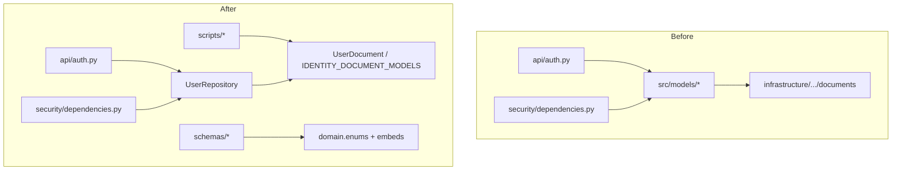

# Remove `backend/src/models/` Compatibility Shims

## Goal

Complete ADR-003 Strangler Fig migration by eliminating the [`backend/src/models/`](backend/src/models/) shim layer. After this change, all imports resolve to:

- **Domain types** → [`backend/src/domain/`](backend/src/domain/) (`UserRole`, entities)
- **Persistence** → [`backend/src/infrastructure/persistence/mongo/documents/`](backend/src/infrastructure/persistence/mongo/documents/) (`UserDocument`, `IDENTITY_DOCUMENT_MODELS`)
- **Embeds/utils** → [`backend/src/infrastructure/persistence/mongo/embeds.py`](backend/src/infrastructure/persistence/mongo/embeds.py), [`_utils.py`](backend/src/infrastructure/persistence/mongo/_utils.py)



## Import Mapping

| Old import | New import | Used by |
|------------|------------|---------|
| `src.models.enums.UserRole` | `src.domain.enums.UserRole` | schemas, security, tests |
| `src.models.embeds.MobileInfo` | `src.infrastructure.persistence.mongo.embeds.MobileInfo` | schemas |
| `src.models._utils.as_hk` | `src.infrastructure.persistence.mongo._utils.as_hk` | security/security.py |
| `src.models.user_doc.UserDoc` | **Remove** — use `get_user_repository().find_by_id()` | auth.py, security |
| `src.models.membership_doc.MembershipDoc` | **Remove** — use `get_membership_repository().find_by_tenant_and_user()` | security |
| `src.models.tenant_doc.TenantDoc` | **Remove** — use `get_tenant_repository().find_by_id()` | tenants.py |
| `src.models.IDENTITY_DOCUMENT_MODELS` | `src.infrastructure.persistence.mongo.documents.IDENTITY_DOCUMENT_MODELS` | conftest, scripts, tests |
| `UserDoc` in migration scripts | `UserDocument` from documents | migrate_remove_user_role.py |
| `TenantDoc` / `MembershipDoc` in scripts | `TenantDocument` / `MembershipDocument` | migrate_rbac_phase3.py |

**Out of scope:** [`backend/src/modules/identity/models/`](backend/src/modules/identity/models/) already re-exports from infrastructure and has no external consumers; leave as-is unless you want a follow-up to collapse it.

## Step 1 — Simple import swaps (no behavior change)

Update these files to use domain/infrastructure paths directly:

- [`backend/src/schemas/auth.py`](backend/src/schemas/auth.py)
- [`backend/src/schemas/reference.py`](backend/src/schemas/reference.py)
- [`backend/src/security/principal.py`](backend/src/security/principal.py)
- [`backend/src/security/security.py`](backend/src/security/security.py)
- [`backend/tests/test_phase3_rbac.py`](backend/tests/test_phase3_rbac.py)
- [`backend/tests/conftest.py`](backend/tests/conftest.py)
- [`backend/tests/test_models.py`](backend/tests/test_models.py)
- [`backend/tests/test_phase1_boundaries.py`](backend/tests/test_phase1_boundaries.py) — change `IDENTITY_DOCUMENT_MODELS` import only (directory path updates in Step 4)
- [`backend/scripts/export_identity_tenant.py`](backend/scripts/export_identity_tenant.py)

## Step 2 — Refactor API routes to repositories

### [`backend/src/api/auth.py`](backend/src/api/auth.py)

Replace the `/me`, `/me/permissions`, `/patch /me` pattern:

```python
user_doc = await get_identity_or_404(UserDoc, "user_id", principal.user_id)
user = UserMapper.to_domain(user_doc)
```

With:

```python
user = await get_user_repository().find_by_id(principal.user_id)
if user is None:
    raise HTTPException(status_code=404, detail="User not found.")
```

Remove imports: `UserDoc`, `get_identity_or_404`, `UserMapper`.

### [`backend/src/modules/identity/api/tenants.py`](backend/src/modules/identity/api/tenants.py)

Replace `get_tenant` handler:

```python
doc = await get_identity_or_404(TenantDoc, "tenant_id", tenant_id)
tenant = await get_tenant_repository().find_by_id(doc.tenant_id)
```

With a single repository call + 404. Remove `TenantDoc`, `get_identity_or_404`.

### [`backend/src/api/identity_routers.py`](backend/src/api/identity_routers.py)

Remove unused imports: `UserDoc`, `get_identity_or_404` (already dead imports).

## Step 3 — Refactor security to repositories (user choice)

In [`backend/src/security/dependencies.py`](backend/src/security/dependencies.py), rewrite `_load_principal()`:

- `UserDoc.find_one(...)` → `await get_user_repository().find_by_id(principal.user_id)`
- `MembershipDoc.find_one(..., is_active=True)` → `membership = await get_membership_repository().find_by_tenant_and_user(tenant_id, user_id)` then guard with `if membership and membership.is_active:`

Import `get_user_repository`, `get_membership_repository` from [`backend/src/infrastructure/dependencies.py`](backend/src/infrastructure/dependencies.py). Use `MembershipMapper.to_domain` only if still needed — with repository returns, mapper call is unnecessary.

Preserve existing Principal field population and permission resolution via `get_authorization_service().permissions_for_membership()`.

## Step 4 — Update migration scripts

Scripts are infrastructure-level; direct Beanie document access is acceptable:

- [`backend/scripts/migrate_remove_user_role.py`](backend/scripts/migrate_remove_user_role.py): `UserDocument` instead of `UserDoc`
- [`backend/scripts/migrate_rbac_phase3.py`](backend/scripts/migrate_rbac_phase3.py): `TenantDocument`, `MembershipDocument`

## Step 5 — Remove obsolete helpers

In [`backend/src/services/base.py`](backend/src/services/base.py):

- Delete `get_identity_or_404()` once no callers remain
- Keep `format_duplicate_key_error()` (used by [`main.py`](backend/src/main.py))

If `services/base.py` only contains `format_duplicate_key_error`, consider moving it to a more appropriate module (e.g. `infrastructure/persistence/mongo/_utils.py` or a small `shared/errors.py`) — optional, not required for this cleanup.

## Step 6 — Delete `backend/src/models/`

Remove the entire directory (11 files):

```
backend/src/models/__init__.py
backend/src/models/*_doc.py
backend/src/models/enums.py
backend/src/models/embeds.py
backend/src/models/_utils.py
```

## Step 7 — Update boundary tests and docs

### Tests — [`backend/tests/test_phase1_boundaries.py`](backend/tests/test_phase1_boundaries.py)

- Import `IDENTITY_DOCUMENT_MODELS` from `infrastructure.persistence.mongo.documents`
- Change `MODELS_DIR` to `BACKEND_ROOT / "src" / "infrastructure" / "persistence" / "mongo" / "documents"`
- Add `test_models_shim_directory_removed`: assert `backend/src/models` does not exist
- Add `test_no_src_models_imports` (optional): grep/static check that no file under `backend/src` imports `src.models`

### Docs

- [`docs/architecture/adr/003-hexagonal-architecture.md`](docs/architecture/adr/003-hexagonal-architecture.md): remove "backward-compatible shims" bullet; note shims removed
- [`docs/architecture/DATA_SCHEMA.md`](docs/architecture/DATA_SCHEMA.md): remove "Compatibility shims" row from Source References table

## Step 8 — Verify

```bash
cd backend
rg "from src\.models|import src\.models" .   # expect zero matches
poetry run pytest -q                          # expect all tests pass
```

## Risk Notes

- **Behavior parity:** `find_by_tenant_and_user` does not filter `is_active` at DB level today in the repository; the security layer must explicitly check `membership.is_active` to match current JWT guard behavior.
- **Migration scripts:** one-time ops scripts; renaming `UserDoc` → `UserDocument` is safe with no runtime impact on the service.
- **No API contract change:** HTTP responses and JWT behavior unchanged.

## Files Touched (summary)

| Action | Files |
|--------|-------|
| Edit | auth.py, identity_routers.py, tenants.py, security/dependencies.py, security/principal.py, security/security.py, schemas/auth.py, schemas/reference.py, services/base.py, 3 scripts, 4 test files |
| Delete | `backend/src/models/` (entire directory) |
| Docs | ADR-003, DATA_SCHEMA.md |
