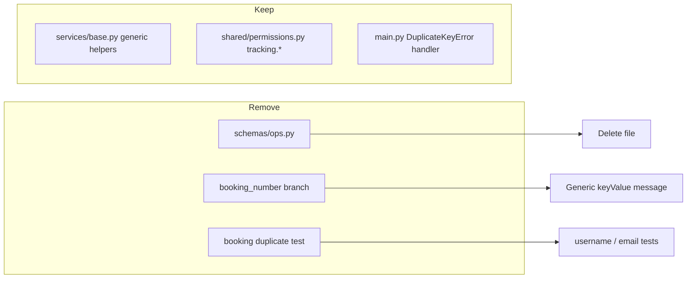

# Remove Monolith Legacy Traces from Identity Service

## Scope

**In scope (Tracking business remnants to remove):**

| File | Issue |
|------|-------|
| [`backend/src/schemas/ops.py`](backend/src/schemas/ops.py) | Entire file is dead Tracking ops schemas (Alert, LocationSnapshot, `component_id`/`kit_id`/`booking_id`). Zero imports; broken imports (`AlertSeverity` etc. no longer exist in [`backend/src/models/enums.py`](backend/src/models/enums.py)). **Delete file.** |
| [`backend/src/services/base.py`](backend/src/services/base.py) | `format_duplicate_key_error()` has a `booking_number` special-case branch copied from Tracking. **Remove branch; keep generic handler.** |
| [`backend/tests/test_duplicate_key_errors.py`](backend/tests/test_duplicate_key_errors.py) | Tests the removed booking branch. **Replace with Identity-relevant duplicate cases.** |
| [`backend/tests/test_phase1_boundaries.py`](backend/tests/test_phase1_boundaries.py) | Already guards Tracking models/API files. **Extend to forbid Tracking schema files.** |

**Out of scope (intentional, not legacy):**

- [`backend/src/shared/permissions.py`](backend/src/shared/permissions.py) — `tracking.*` codes are the IAM permission catalog (JWT `perm_ver` / role templates); required by [`IDENTITY_CONTRACT.md`](docs/architecture/IDENTITY_CONTRACT.md).
- `resolve_role_ids_for_legacy`, JWT `role` claim, `UserRole` enum — documented backward-compat in [`DATA_SCHEMA.md`](docs/architecture/DATA_SCHEMA.md).
- RBAC tests referencing `tracking.booking.write` in [`backend/tests/test_phase3_rbac.py`](backend/tests/test_phase3_rbac.py) — valid permission-catalog tests.



## Implementation Steps

### 1. Delete dead Tracking schema file

Remove [`backend/src/schemas/ops.py`](backend/src/schemas/ops.py) entirely. No import sites exist (verified via repo search).

### 2. Simplify duplicate-key error formatter

In [`backend/src/services/base.py`](backend/src/services/base.py), edit `format_duplicate_key_error()` to remove lines 30–34 (the `booking_number` branch). Retain the existing generic fallback:

```python
if key_value:
    field, value = next(iter(key_value.items()))
    return f"A record with {field}={value!r} already exists."
return "A record with the same unique value already exists."
```

Optional small cleanup in the same file: remove unused `conflict()` helper (defined but never imported).

Keep `get_identity_or_404()` unchanged — it is actively used by auth and tenant routes.

### 3. Update duplicate-key tests

In [`backend/tests/test_duplicate_key_errors.py`](backend/tests/test_duplicate_key_errors.py):

- Remove `test_booking_number_duplicate_message`.
- Add Identity-relevant cases, e.g.:
  - `username` duplicate (matches real unique index on users)
  - `email` duplicate (if applicable to index pattern)
- Keep `test_generic_duplicate_message` (still valid).

### 4. Extend Phase 1 boundary guard

In [`backend/tests/test_phase1_boundaries.py`](backend/tests/test_phase1_boundaries.py), add a schema guard similar to existing model/API checks:

```python
FORBIDDEN_SCHEMA_FILES = ("ops.py",)

def test_no_tracking_schema_files(self) -> None:
    existing = {path.name for path in SCHEMAS_DIR.glob("*.py")}
    for forbidden in FORBIDDEN_SCHEMA_FILES:
        self.assertNotIn(forbidden, existing)
```

Define `SCHEMAS_DIR = BACKEND_ROOT / "src" / "schemas"`.

### 5. Verify

From `backend/`:

```bash
poetry run pytest tests/test_duplicate_key_errors.py tests/test_phase1_boundaries.py -q
poetry run pytest -q
```

Confirm no import errors and all boundary tests pass.

## Risk Assessment

- **API contract:** None. `schemas/ops.py` is unreferenced; OpenAPI in [`IDENTITY_CONTRACT.md`](docs/architecture/IDENTITY_CONTRACT.md) does not list Alert/Location endpoints.
- **Runtime behavior:** Duplicate-key responses for Identity unique fields (`username`, `email`, `tenant_slug`) will use the generic message — appropriate for this service.
- **No doc changes required** unless you want a one-line note in ADR-003 legacy cleanup section (optional).

## Files Changed (expected)

- Delete: `backend/src/schemas/ops.py`
- Edit: `backend/src/services/base.py`, `backend/tests/test_duplicate_key_errors.py`, `backend/tests/test_phase1_boundaries.py`
