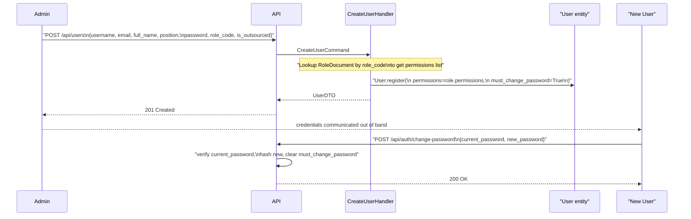

# Single-Tenant Schema Redesign + Admin-Create Flow

## Context: What Orion does right (single-tenant reference)

- One `role` string per user (`management`/`sales`/`delivery`) — no separate membership collection
- `status: "active" | "suspended" | "deactivated"` (richer than `is_active: bool`)
- `failed_login_count`, `lockout_until`, `last_login_at` on user document
- `updated_at` on user document
- No `TenantDocument`, no `MembershipDocument`, no `InviteDocument`

## Current state of documents (partially updated by user)

`UserDocument` already has `position: str`, `permissions: list[str]`, but still missing: `status`, lockout fields, `last_login_at`, `updated_at`, `must_change_password`, `is_outsourced`.  
`TenantDocument`, `PermissionDocument`, `RoleDocument(tenant_id)` are still in place.

---

## Phase 1 — Target Document Schema

### What gets REMOVED

| Document | Reason |
|---|---|
| `TenantDocument` | Single tenant — no per-tenant config needed |
| `MembershipDocument` | Already removed — users aren't scoped to tenants |
| `InviteDocument` | Already removed — admin-create flow replaces invite |
| `PermissionDocument` | Permission codes are code constants (`shared/permissions.py`); no DB catalog needed |

### Final `UserDocument`

```python
class UserDocument(Document):
    user_id: Indexed(str, unique=True)
    username: Indexed(str, unique=True)
    email: Indexed(str, unique=True)
    full_name: str
    phone: Optional[MobileInfo] = None
    position: str = ""                             # job title / position
    password_hash: str
    must_change_password: bool = False             # set True on admin-create
    is_outsourced: bool = False
    permissions: list[str] = []                    # effective permission codes
    status: str = "active"                         # "active" | "suspended" | "deactivated"
    failed_login_count: int = 0                    # lockout support (Orion pattern)
    lockout_until: Optional[HongKongDatetime] = None
    last_login_at: Optional[HongKongDatetime] = None
    created_at: HongKongDatetime
    updated_at: Optional[HongKongDatetime] = None
    class Settings:
        name = "users"
        indexes = [("status",)]
```

**Key design decisions:**
- `permissions: list[str]` is the source of truth for what a user can do — stored directly on the document (denormalised from role template at creation time, for fast JWT building)
- `status` replaces `is_active: bool` — captures permanent "deactivated" vs temporary "suspended"
- No `role_code` persisted on user — role templates in `RoleDocument` are used at creation time to populate `permissions`; the role label is not stored on the user (admins assign a role template, permissions get copied)

### Final `RoleDocument` (simplified, single-tenant)

```python
class RoleDocument(Document):
    role_id: Indexed(str, unique=True)
    # REMOVED: tenant_id — single tenant, no per-tenant role copies
    code: Indexed(str, unique=True)               # "admin", "operations", etc.
    name: str
    permissions: list[str] = []                   # template permissions
    is_system: bool = True                        # True = seeded by platform
    created_at: HongKongDatetime
    updated_at: Optional[HongKongDatetime] = None
    class Settings:
        name = "roles"
```

### `AuthEventDocument` (simplified, no tenant_id)

```python
class AuthEventDocument(Document):
    event_id: Indexed(str, unique=True)
    event_type: Indexed(str)
    # REMOVED: tenant_id — single tenant
    user_id: Optional[Indexed(str)] = None
    actor_user_id: Optional[str] = None
    detail: dict = {}
    created_at: HongKongDatetime
    class Settings:
        name = "auth_events"
        indexes = [[("event_type", 1), ("created_at", -1)]]
```

### `OutboxDocument` — unchanged

---

## Phase 1 Cascade (document to full stack)

The single-tenant simplification ripples through every layer:

```mermaid
flowchart LR
    subgraph remove ["Remove entirely"]
        TD[TenantDocument]
        TE[Tenant entity]
        TR[TenantRepository]
        TM[TenantMapper]
        TC["Tenant commands\nregister/suspend/activate"]
        MS[MembershipService]
        ME[Membership entity]
        MR[MembershipRepository]
        MM[MembershipMapper]
        IE[Invite entity]
        IC[Invite commands]
        IR[InviteRepository]
        IM[InviteMapper]
        PC[PermissionCatalogRepository]
        PR[PermissionDocument]
    end

    subgraph simplify ["Simplify"]
        UA["User entity\nadd status, lockout, must_change_pwd"]
        AS["AuthorizationService\nremove tenant roles, resolve_role_ids_for_legacy"]
        DT["UserDTO\nremove tenant_id/perm_ver, add status/must_change_pwd"]
        RP["RoleRepository\nremove tenant_id queries"]
        AER["AuthEventRepository\nremove tenant_id queries"]
    end

    remove --> simplify
```



**Files that change:**

- [`documents/__init__.py`](backend/src/infrastructure/persistence/mongo/documents/__init__.py) — schema as above; remove `TenantDocument`, `PermissionDocument`
- [`mappers/__init__.py`](backend/src/infrastructure/persistence/mongo/mappers/__init__.py) — remove `TenantMapper`, `MembershipMapper`, `InviteMapper`; update `UserMapper` for new fields
- [`repositories/__init__.py`](backend/src/infrastructure/persistence/mongo/repositories/__init__.py) — remove Mongo impls for Tenant/Membership/Invite/PermissionCatalog; update `MongoUserRepository` for `status` field
- [`domain/entities/user.py`](backend/src/domain/entities/user.py) — add `status`, `must_change_password`, lockout fields; remove `is_active`; update `register()`
- [`domain/entities/`](backend/src/domain/entities/) — delete `tenant.py`, `membership.py`, `invite.py`
- [`domain/repositories/__init__.py`](backend/src/domain/repositories/__init__.py) — remove `TenantRepository`, `MembershipRepository`, `InviteRepository`, `PermissionCatalogRepository`
- [`application/services/authorization_service.py`](backend/src/application/services/authorization_service.py) — remove `ensure_tenant_roles`, `resolve_role_ids_for_legacy`, `bump_tenant_perm_ver`; simplify to `permissions_for_user(user)` returns `user.permissions`
- [`application/services/membership_service.py`](backend/src/application/services/membership_service.py) — delete entirely
- [`application/dto.py`](backend/src/application/dto.py) — remove `tenant_id`, `perm_ver` from `UserDTO`; add `status`, `must_change_password`; remove `InviteResult`, `TenantResult`
- [`application/commands/`](backend/src/application/commands/) — delete invite/tenant command files
- [`domain/enums.py`](backend/src/domain/enums.py) — add `UserStatus`; remove `InviteStatus`
- [`main.py`](backend/src/main.py) — remove tenant/membership lifespan setup; simplify to seed system roles on startup
- API routes — remove invite routes, tenant management routes

---

## Phase 2 — Admin-Create Flow (on clean foundation)

After Phase 1, the admin-create user flow is straightforward:



**New/updated files:**

- `application/commands/create_user.py` (new) — `CreateUserCommand` + `CreateUserHandler`: lookup role by `role_code`, call `User.register(permissions=role.permissions, must_change_password=True)`, save via UoW
- `application/commands/change_password.py` (new) — `ChangePasswordCommand` + `ChangePasswordHandler`
- [`api/identity_routers.py`](backend/src/api/identity_routers.py) — replace inline user-create logic with `CreateUserHandler`
- [`api/auth.py`](backend/src/api/auth.py) — add `POST /auth/change-password`
- [`schemas/reference.py`](backend/src/schemas/reference.py) — update `UserCreate` (add `role_code`, `position`, `is_outsourced`); add `must_change_password` to response

---

## What is intentionally NOT included

- MFA — may be added in a later phase following Orion's pattern
- Avatar upload
- Multi-tenant — entirely removed; all `tenant_id` references purged
- Invite flow — removed; admin-create is the only onboarding path
