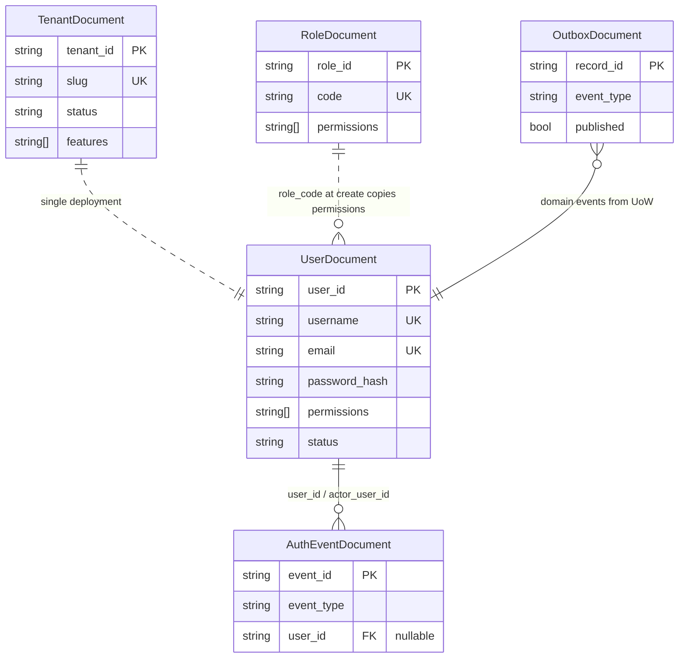

# Identity Service — Data Schema

MongoDB document models for the Pacific Identity Platform, defined with [Beanie ODM](https://beanie-odm.dev/) and Pydantic. Persistence implementations live under `backend/src/infrastructure/persistence/mongo/documents/`.

**Database:** `identity_db` (configurable via `IDENTITY_DATABASE_NAME`)

**Deployment model:** **Single-tenant** — one company profile per deployment (`TENANT_INSTANCE_ID`). Users, roles, and permissions are global within that deployment. There is no membership table, invite flow, or per-tenant role duplication.

**Registered models:** `TenantDocument`, `UserDocument`, `RoleDocument`, `AuthEventDocument`, `OutboxDocument`

---

## Entity Relationships



**Key relationships**

| From | To | Link | Notes |
|------|----|------|-------|
| `UserDocument` | `RoleDocument` | `role_code` at create time | Admin create copies `RoleDocument.permissions` onto the user row; no FK stored on user |
| `UserDocument` | `AuthEventDocument` | `user_id`, `actor_user_id` | Auth audit trail |
| `OutboxDocument` | domain events | `event_type`, `payload` | Transactional outbox for Redis Stream relay |
| `TenantDocument` | deployment | `tenant_id = TENANT_INSTANCE_ID` | One company profile row per deployment; not multi-tenant membership |

**Removed collections (legacy multi-tenant schema)**

| Collection | Replaced by |
|------------|-------------|
| `memberships` | Permissions stored directly on `users.permissions` |
| `invites` | Admin-create flow (`POST /api/users`) |
| `permissions` | Permission codes defined in `src/shared/permissions.py`; optional catalog no longer persisted |

---

## Shared Types

### `MobileInfo` (embedded)

Used on `UserDocument.phone`.

| Field | Type | Required | Description |
|-------|------|----------|-------------|
| `country_code` | `string` | yes | Country calling code without `+` (e.g. `852`) |
| `phone_number` | `string` | yes | Local subscriber number |

Domain `Phone.mobile()` returns E.164 (e.g. `+85291234567`).

### `UserRole` (enum)

API/JWT role label inferred from permission markers at login — **not stored** on `UserDocument`.

| Value | Inferred when |
|-------|---------------|
| `admin` | User has `identity.tenant.admin` or `identity.user.admin` |
| `operations` | Otherwise |

### `UserStatus` (enum)

Stored on `UserDocument.status`.

| Value | Description |
|-------|-------------|
| `active` | Can authenticate |
| `suspended` | Account suspended |
| `deactivated` | Account deactivated |

### Datetime convention

All `created_at`, `updated_at`, `suspended_at`, `lockout_until`, and `last_login_at` fields use `HongKongDatetime` — normalized to `Asia/Hong_Kong` wall time. Naive datetimes from MongoDB BSON are treated as UTC components.

### ID generation

Primary business IDs (`tenant_id`, `user_id`, `role_id`, etc.) are UUID v7 strings via `new_id()`, providing time-sortable identifiers.

---

## Collections

### `tenants` — `TenantDocument`

Single **company profile** for this deployment. Not a multi-tenant registry — there is at most one meaningful row keyed by `TENANT_INSTANCE_ID`.

| Field | Type | Default | Indexed | Description |
|-------|------|---------|---------|-------------|
| `_id` | `ObjectId` | auto | PK | MongoDB document ID (Beanie internal) |
| `tenant_id` | `string` | UUID v7 | unique | Deployment company ID (`TENANT_INSTANCE_ID`) |
| `name` | `string` | — | — | Company display name |
| `slug` | `string` | — | unique | URL-safe slug |
| `status` | `string` | `"active"` | yes | Lifecycle: `active` \| `suspended` |
| `features` | `string[]` | `[]` | — | Entitlement feature flags for this deployment |
| `is_active` | `bool` | `true` | yes | Soft-enable flag |
| `created_at` | `datetime` | now (HK) | — | Creation timestamp |
| `updated_at` | `datetime \| null` | `null` | — | Last profile update |
| `suspended_at` | `datetime \| null` | `null` | — | When company was suspended |

**Indexes:** `(is_active)`, `(status)`, plus unique on `tenant_id` and `slug`.

**API:** `GET /api/company`, `PATCH /api/company`

---

### `users` — `UserDocument`

Global user accounts for this deployment. Credentials, profile, and **permission snapshot** are owned by Identity.

| Field | Type | Default | Indexed | Description |
|-------|------|---------|---------|-------------|
| `_id` | `ObjectId` | auto | PK | MongoDB document ID |
| `user_id` | `string` | UUID v7 | unique | Platform user identifier |
| `username` | `string` | — | unique | Login username |
| `email` | `string` | — | unique | Email address |
| `full_name` | `string` | — | — | Display name |
| `phone` | `MobileInfo \| null` | `null` | — | Optional mobile contact |
| `position` | `string` | `""` | — | Job title / position |
| `password_hash` | `string` | — | — | Hashed password (never exposed via API) |
| `must_change_password` | `bool` | `false` | — | Force password change on next login (admin-created users) |
| `is_outsourced` | `bool` | `false` | — | Outsourced worker flag |
| `permissions` | `string[]` | `[]` | — | Denormalised permission snapshot (copied from role at create/update) |
| `status` | `string` | `"active"` | yes | `active` \| `suspended` \| `deactivated` |
| `failed_login_count` | `int` | `0` | — | Consecutive failed login attempts |
| `lockout_until` | `datetime \| null` | `null` | — | Temporary lockout expiry |
| `last_login_at` | `datetime \| null` | `null` | — | Last successful login |
| `created_at` | `datetime` | now (HK) | — | Creation timestamp |
| `updated_at` | `datetime \| null` | `null` | — | Last update |

**Indexes:** unique on `user_id`, `username`, and `email`; `(status)`.

**Permission resolution:** At user create or role update, permissions are copied from `RoleDocument` by `role_code`. JWT `role` is inferred from permission markers at token issuance; JWT `scopes` carries up to 32 permission codes.

**User provisioning flows**

| Flow | Endpoint | Notes |
|------|----------|-------|
| Bootstrap admin | `POST /api/auth/register` | Allowed only when `users` collection is empty |
| Admin create | `POST /api/users` | Admin sets initial password; `must_change_password=true` |
| Password change | `POST /api/auth/change-password` | Clears `must_change_password` |

---

### `roles` — `RoleDocument`

Global RBAC role templates for this deployment. Seeded at startup from `PLATFORM_ROLE_TEMPLATES` in `src/shared/permissions.py`.

| Field | Type | Default | Indexed | Description |
|-------|------|---------|---------|-------------|
| `_id` | `ObjectId` | auto | PK | MongoDB document ID |
| `role_id` | `string` | UUID v7 | unique | Role identifier |
| `code` | `string` | — | unique | Role code (e.g. `admin`, `operations`) |
| `name` | `string` | — | — | Human-readable name |
| `permissions` | `string[]` | `[]` | — | Permission codes granted by this role |
| `is_system` | `bool` | `true` | yes | System-managed role (not user-editable) |
| `created_at` | `datetime` | now (HK) | — | Creation timestamp |
| `updated_at` | `datetime \| null` | `null` | — | Last template sync |

**Indexes:** unique on `role_id` and `code`; `(is_system)`.

**System templates**

| `code` | Permissions |
|--------|-------------|
| `admin` | All permissions in catalog |
| `operations` | Operational subset (see [Permission catalog](#permission-catalog)) |

> **Migration note:** Legacy multi-tenant rows stored one role per tenant with the same `code`. Startup runs `reconcile_stale_indexes()` in `infrastructure/migrations.py` to drop stale indexes, dedupe by `code`, and allow the global unique index on `code`.

---

### `auth_events` — `AuthEventDocument`

Auth audit log. Not tenant-scoped — single deployment context.

| Field | Type | Default | Indexed | Description |
|-------|------|---------|---------|-------------|
| `_id` | `ObjectId` | auto | PK | MongoDB document ID |
| `event_id` | `string` | UUID v7 | unique | Event identifier |
| `event_type` | `string` | — | yes | Event category (see below) |
| `user_id` | `string \| null` | `null` | yes | Subject user |
| `actor_user_id` | `string \| null` | `null` | — | Acting user (admin actions) |
| `detail` | `object` | `{}` | — | Arbitrary event payload |
| `created_at` | `datetime` | now (HK) | — | Event timestamp |

**Indexes:** `(event_type, created_at DESC)`, plus unique on `event_id`.

**Known `event_type` values**

| Event | Description |
|-------|-------------|
| `user.registered` | Bootstrap admin account created |
| `auth.login` | Successful login |
| `auth.login_failed` | Failed login attempt |
| `auth.password_changed` | User changed password |

**API:** `GET /api/auth/events` (requires `identity.audit.read`)

---

### `outbox` — `OutboxDocument`

Transactional outbox for domain events. Relay worker publishes to Redis Streams when `EVENT_TRANSPORT=redis_streams`.

| Field | Type | Default | Indexed | Description |
|-------|------|---------|---------|-------------|
| `_id` | `ObjectId` | auto | PK | MongoDB document ID |
| `record_id` | `string` | — | unique | Outbox record identifier |
| `event_type` | `string` | — | — | Domain event class name (e.g. `UserRegistered`) |
| `payload` | `object` | `{}` | — | Serialised `DomainEvent.to_dict()` |
| `published` | `bool` | `false` | yes | Relay completion flag |
| `created_at` | `datetime` | now (HK) | — | Enqueue timestamp |
| `published_at` | `datetime \| null` | `null` | — | When relay marked published |

**Indexes:** `(published, created_at)`.

---

## Permission Catalog

Permission codes use capability prefixes: `identity.*`, `tracking.*`, `product.*`, `tender.*`. Defined in `backend/src/shared/permissions.py`.

### Identity permissions

| Code | Description |
|------|-------------|
| `identity.tenant.admin` | Company profile administration |
| `identity.user.admin` | User CRUD |
| `identity.user.read` | User directory read |
| `identity.invite.manage` | Legacy code; invite flow removed |
| `identity.audit.read` | Auth audit log read |

### Tracking permissions (granted via roles, enforced in Tracking service)

| Code | Description |
|------|-------------|
| `tracking.dashboard.read` | Dashboard access |
| `tracking.directory.read` | User directory |
| `tracking.product.read` / `tracking.product.write` | Product catalog |
| `tracking.customer.read` / `tracking.customer.write` | Customers |
| `tracking.location.read` / `tracking.location.write` | Locations |
| `tracking.kit.read` / `tracking.kit.write` | Kits |
| `tracking.component.read` / `tracking.component.write` | Components |
| `tracking.composition.write` | Kit composition |
| `tracking.tag.write` | Tag assignment |
| `tracking.booking.read` / `tracking.booking.write` / `tracking.booking.workflow` | Bookings |
| `tracking.dn.read` / `tracking.dn.write` / `tracking.dn.sign` | Delivery notes |
| `tracking.cn.read` / `tracking.cn.write` / `tracking.cn.sign` | Collection notes |
| `tracking.scan.execute` | Scan operations |
| `tracking.inspection.write` | Inspections |
| `tracking.snapshot.write` | Snapshots |
| `tracking.alert.read` / `tracking.alert.write` | Alerts |

### Bootstrap feature entitlements

Default company `features` are seeded from `PLAN_FEATURES["enterprise"]` at first startup. Features are stored on `TenantDocument.features` and editable via `PATCH /api/company`. There is no persisted `plan` field.

---

## Permission Snapshots

Permissions are **denormalised on the user row** at create/update time. There is no `perm_ver` versioning or membership snapshot in the single-tenant schema.

```
RoleDocument.permissions  ──copy at create/update──▶  UserDocument.permissions  ──mirror──▶  JWT scopes (capped)
```

When an admin changes a user's `role_code`, the handler reloads the role template and rewrites `UserDocument.permissions`. Downstream services should treat JWT permission claims as authoritative until the token expires, or re-fetch via `GET /api/auth/me/permissions`.

---

## Source References

| Artifact | Path |
|----------|------|
| Domain entities | `backend/src/domain/entities/` |
| Persistence documents | `backend/src/infrastructure/persistence/mongo/documents/` |
| Model registry | `backend/src/infrastructure/persistence/mongo/documents/__init__.py` → `IDENTITY_DOCUMENT_MODELS` |
| Enums & embeds | `backend/src/domain/enums.py`, `infrastructure/persistence/mongo/embeds.py` |
| Permission catalog | `backend/src/shared/permissions.py` |
| RBAC resolution | `backend/src/application/services/authorization_service.py` |
| Index migration | `backend/src/infrastructure/migrations.py` |
| Database init | `backend/src/infrastructure/database.py` |
| JWT contract | `docs/architecture/IDENTITY_CONTRACT.md` |
| Event contract | `docs/architecture/EVENT_CONTRACT.md` |
