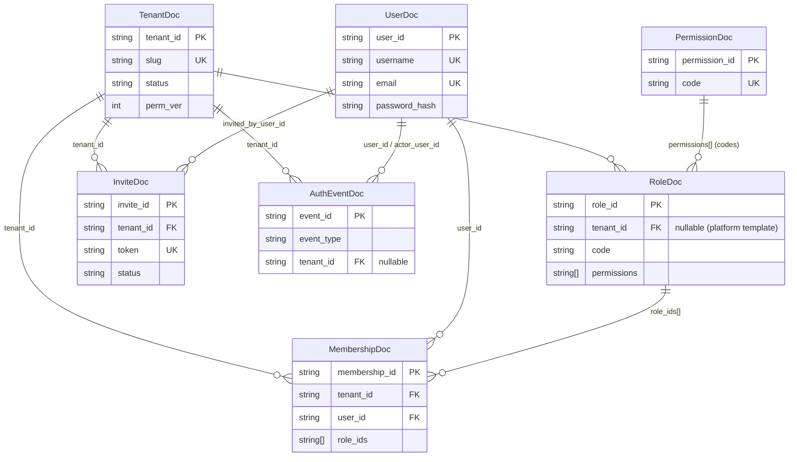

# Identity Service — Data Schema

MongoDB document models for the Pacific Identity Platform, defined with [Beanie ODM](https://beanie-odm.dev/) and Pydantic. Persistence implementations live under `backend/src/infrastructure/persistence/mongo/documents/`; `backend/src/models/` provides compatibility shims (`UserDoc`, etc.).

**Database:** `identity_db` (configurable via `IDENTITY_DATABASE_NAME`)

**Registered models:** `TenantDoc`, `MembershipDoc`, `UserDoc`, `RoleDoc`, `PermissionDoc`, `InviteDoc`, `AuthEventDoc`

---

## Entity Relationships



**Key relationships**

| From | To | Link | Notes |
|------|----|------|-------|
| `MembershipDoc` | `TenantDoc` | `tenant_id` | One user may belong to multiple tenants via separate memberships |
| `MembershipDoc` | `UserDoc` | `user_id` | Composite index on `(tenant_id, user_id)` |
| `MembershipDoc` | `RoleDoc` | `role_ids[]` | Phase 3 RBAC; legacy `role` enum resolved to role IDs at runtime |
| `RoleDoc` | `PermissionDoc` | `permissions[]` | Permission codes stored on roles; catalog is optional registry |
| `InviteDoc` | `TenantDoc` | `tenant_id` | Self-serve tenant onboarding |
| `AuthEventDoc` | `TenantDoc` / `UserDoc` | `tenant_id`, `user_id`, `actor_user_id` | Audit trail for auth and tenant lifecycle |

---

## Shared Types

### `MobileInfo` (embedded)

Used on `UserDoc.phone`.

| Field | Type | Required | Description |
|-------|------|----------|-------------|
| `country_code` | `string` | yes | Country calling code (e.g. `852`) |
| `phone_number` | `string` | yes | Local subscriber number |

### `UserRole` (enum)

Legacy role label retained on `UserDoc` and `MembershipDoc` for JWT claim `role` and early clients.

| Value | Description |
|-------|-------------|
| `admin` | Full platform permissions |
| `operations` | Standard operational permissions |

### Datetime convention

All `created_at`, `suspended_at`, `expires_at`, and `accepted_at` fields use `HongKongDatetime` — normalized to `Asia/Hong_Kong` wall time. Naive datetimes from MongoDB BSON are treated as UTC components.

### ID generation

Primary business IDs (`tenant_id`, `user_id`, `membership_id`, etc.) are UUID v7 strings via `new_id()`, providing time-sortable identifiers.

---

## Collections

### `tenants` — `TenantDoc`

Basic tenant metadata owned by Identity. Business entities (Customer, Asset, Booking, etc.) live in the Tracking service.

| Field | Type | Default | Indexed | Description |
|-------|------|---------|---------|-------------|
| `_id` | `ObjectId` | auto | PK | MongoDB document ID (Beanie internal) |
| `tenant_id` | `string` | UUID v7 | unique | Platform tenant identifier |
| `name` | `string` | — | — | Display name |
| `slug` | `string` | — | unique | URL-safe tenant slug |
| `plan` | `string` | `"enterprise"` | yes | Subscription plan (`starter`, `professional`, `enterprise`) |
| `status` | `string` | `"active"` | yes | Lifecycle: `active` \| `suspended` \| `pending` |
| `features` | `string[]` | `[]` | — | Entitlement feature flags (derived from plan) |
| `is_active` | `bool` | `true` | yes | Soft-enable flag |
| `perm_ver` | `int` | `1` | — | Bumped when any membership/role permission changes in this tenant |
| `created_at` | `datetime` | now (HK) | — | Creation timestamp |
| `suspended_at` | `datetime \| null` | `null` | — | When tenant was suspended |

**Indexes:** `(is_active)`, `(status)`, `(plan)`, plus unique on `tenant_id` and `slug`.

---

### `users` — `UserDoc`

Global user accounts. Credentials and profile data are owned exclusively by Identity.

| Field | Type | Default | Indexed | Description |
|-------|------|---------|---------|-------------|
| `_id` | `ObjectId` | auto | PK | MongoDB document ID |
| `user_id` | `string` | UUID v7 | unique | Platform user identifier |
| `username` | `string` | — | unique | Login username |
| `email` | `string` | — | unique | Email address |
| `full_name` | `string` | — | — | Display name |
| `phone` | `MobileInfo \| null` | `null` | — | Optional mobile contact |
| `password_hash` | `string` | — | — | Hashed password (never exposed via API) |
| `is_outsourced` | `bool` | `false` | — | Outsourced worker flag |
| `is_active` | `bool` | `true` | — | Account enabled |
| `created_at` | `datetime` | now (HK) | — | Creation timestamp |

**Indexes:** unique on `user_id`, `username`, and `email`.

> **Note:** User role is stored on `MembershipDoc`, not `UserDoc`. JWT `role` claim is resolved from membership at login.

---

### `memberships` — `MembershipDoc`

Links a user to a tenant with role assignments and a permission snapshot version.

| Field | Type | Default | Indexed | Description |
|-------|------|---------|---------|-------------|
| `_id` | `ObjectId` | auto | PK | MongoDB document ID |
| `membership_id` | `string` | UUID v7 | unique | Membership identifier |
| `tenant_id` | `string` | — | yes | FK → `tenants.tenant_id` |
| `user_id` | `string` | — | yes | FK → `users.user_id` |
| `role` | `UserRole` | — | yes | Legacy enum claim (JWT `ver:1` / early clients) |
| `role_ids` | `string[]` | `[]` | — | FK → `roles.role_id` (Phase 3 RBAC) |
| `perm_ver` | `int` | `1` | — | Per-membership permission snapshot version (mirrored on JWT) |
| `is_active` | `bool` | `true` | yes | Membership enabled |
| `created_at` | `datetime` | now (HK) | — | Creation timestamp |

**Indexes:** `(tenant_id, user_id)`, `(role)`, `(is_active)`, plus unique on `membership_id`.

**Permission resolution:** If `role_ids` is empty, the service resolves from legacy `role` via tenant-scoped `RoleDoc` templates (`admin` / `operations`) and backfills `role_ids`.

---

### `roles` — `RoleDoc`

RBAC role definitions. Platform templates (`tenant_id = null`) are copied per tenant on first use.

| Field | Type | Default | Indexed | Description |
|-------|------|---------|---------|-------------|
| `_id` | `ObjectId` | auto | PK | MongoDB document ID |
| `role_id` | `string` | UUID v7 | unique | Role identifier |
| `tenant_id` | `string \| null` | `null` | yes | `null` = platform template; set for per-tenant roles |
| `code` | `string` | — | yes | Role code (e.g. `admin`, `operations`) |
| `name` | `string` | — | — | Human-readable name |
| `permissions` | `string[]` | `[]` | — | Permission codes granted by this role |
| `is_system` | `bool` | `true` | yes | System-managed role (not user-editable) |
| `created_at` | `datetime` | now (HK) | — | Creation timestamp |

**Indexes:** `(tenant_id, code)`, `(is_system)`, plus unique on `role_id`.

**Platform templates**

| `code` | Permissions |
|--------|-------------|
| `admin` | All permissions in catalog |
| `operations` | Operational subset (see [Permission catalog](#permission-catalog)) |

---

### `permissions` — `PermissionDoc`

Optional permission registry. Codes are also stored directly on `RoleDoc.permissions`; the catalog is seeded from `src/shared/permissions.py`.

| Field | Type | Default | Indexed | Description |
|-------|------|---------|---------|-------------|
| `_id` | `ObjectId` | auto | PK | MongoDB document ID |
| `permission_id` | `string` | UUID v7 | unique | Permission identifier |
| `code` | `string` | — | unique | Dot-separated capability code (e.g. `identity.user.admin`) |
| `description` | `string` | `""` | — | Human-readable description |
| `created_at` | `datetime` | now (HK) | — | Creation timestamp |

**Indexes:** unique on `permission_id` and `code`.

---

### `invites` — `InviteDoc`

Tenant invitations for self-serve membership onboarding.

| Field | Type | Default | Indexed | Description |
|-------|------|---------|---------|-------------|
| `_id` | `ObjectId` | auto | PK | MongoDB document ID |
| `invite_id` | `string` | UUID v7 | unique | Invite identifier |
| `tenant_id` | `string` | — | yes | FK → `tenants.tenant_id` |
| `email` | `string` | — | yes | Invitee email |
| `role_code` | `string` | `"operations"` | — | Role to assign on acceptance |
| `token` | `string` | UUID v7 | unique | Single-use acceptance token |
| `status` | `string` | `"pending"` | yes | `pending` \| `accepted` \| `revoked` \| `expired` |
| `invited_by_user_id` | `string \| null` | `null` | — | FK → `users.user_id` (inviter) |
| `expires_at` | `datetime` | — | — | Token expiry |
| `accepted_at` | `datetime \| null` | `null` | — | When invite was accepted |
| `created_at` | `datetime` | now (HK) | — | Creation timestamp |

**Indexes:** `(tenant_id, email)`, `(status)`, plus unique on `invite_id` and `token`.

---

### `auth_events` — `AuthEventDoc`

Auth and RBAC audit log. Tenant-scoped reads via `GET /api/auth/events`.

| Field | Type | Default | Indexed | Description |
|-------|------|---------|---------|-------------|
| `_id` | `ObjectId` | auto | PK | MongoDB document ID |
| `event_id` | `string` | UUID v7 | unique | Event identifier |
| `event_type` | `string` | — | yes | Event category (see below) |
| `tenant_id` | `string \| null` | `null` | yes | FK → `tenants.tenant_id` |
| `user_id` | `string \| null` | `null` | yes | Subject user |
| `actor_user_id` | `string \| null` | `null` | — | Acting user (admin actions) |
| `detail` | `object` | `{}` | — | Arbitrary event payload |
| `created_at` | `datetime` | now (HK) | — | Event timestamp |

**Indexes:** `(tenant_id, created_at DESC)`, `(event_type, created_at DESC)`, plus unique on `event_id`.

**Known `event_type` values**

| Event | Description |
|-------|-------------|
| `user.registered` | New user account created |
| `tenant.registered` | Self-serve tenant signup |
| `auth.login` | Successful login |
| `auth.login_failed` | Failed login attempt |
| `invite.created` | Tenant invite issued |
| `invite.accepted` | Invite redeemed |
| `tenant.suspended` | Tenant suspended by admin |
| `tenant.activated` | Tenant re-activated |
| `billing.webhook` | Billing/entitlements webhook received |

---

## Permission Catalog

Permission codes use capability prefixes: `identity.*`, `tracking.*`, `product.*`, `tender.*`. Defined in `backend/src/shared/permissions.py`.

### Identity permissions

| Code | Description |
|------|-------------|
| `identity.tenant.admin` | Tenant administration |
| `identity.user.admin` | User CRUD |
| `identity.user.read` | User directory read |
| `identity.invite.manage` | Invite management |
| `identity.audit.read` | Auth audit log read |

### Tracking permissions (granted via roles, enforced in Tracking service)

| Code | Description |
|------|-------------|
| `tracking.dashboard.read` | Dashboard access |
| `tracking.directory.read` | User directory |
| `tracking.product.read` / `tracking.product.write` | Product catalog |
| `tracking.customer.read` / `tracking.customer.write` | Customers |
| `tracking.location.read` / `tracking.location.write` | Locations |
| `tracking.kit.read` / `tracking.kit.write` | Kits |
| `tracking.component.read` / `tracking.component.write` | Components |
| `tracking.composition.write` | Kit composition |
| `tracking.tag.write` | Tag assignment |
| `tracking.booking.read` / `tracking.booking.write` / `tracking.booking.workflow` | Bookings |
| `tracking.dn.read` / `tracking.dn.write` / `tracking.dn.sign` | Delivery notes |
| `tracking.cn.read` / `tracking.cn.write` / `tracking.cn.sign` | Collection notes |
| `tracking.scan.execute` | Scan operations |
| `tracking.inspection.write` | Inspections |
| `tracking.snapshot.write` | Snapshots |
| `tracking.alert.read` / `tracking.alert.write` | Alerts |

### Plan → feature entitlements

| Plan | Features |
|------|----------|
| `starter` | `tracking.core` |
| `professional` | `tracking.core`, `tracking.scan`, `tracking.documents` |
| `enterprise` | Above + `tracking.alerts`, `product.intel`, `tender.intel` |

---

## Permission Versioning (`perm_ver`)

When role permissions change for a tenant, `TenantDoc.perm_ver` is incremented and all `MembershipDoc.perm_ver` values for that tenant are updated. JWT access tokens carry `perm_ver` so downstream services can invalidate cached permission snapshots without re-querying Identity on every request.

```
TenantDoc.perm_ver  ──bump──▶  MembershipDoc.perm_ver  ──mirror──▶  JWT claim perm_ver
```

---

## Source References

| Artifact | Path |
|----------|------|
| Domain entities | `backend/src/domain/entities/` |
| Persistence documents | `backend/src/infrastructure/persistence/mongo/documents/` |
| Compatibility shims | `backend/src/models/*_doc.py` |
| Model registry | `backend/src/infrastructure/persistence/mongo/documents/__init__.py` → `IDENTITY_DOCUMENT_MODELS` |
| Enums & embeds | `backend/src/domain/enums.py`, `infrastructure/persistence/mongo/embeds.py` |
| Permission catalog | `backend/src/shared/permissions.py` |
| RBAC resolution | `backend/src/application/services/authorization_service.py` |
| Database init | `backend/src/infrastructure/database.py` |
| JWT contract | `docs/architecture/IDENTITY_CONTRACT.md` |
| Event contract | `docs/architecture/EVENT_CONTRACT.md` |
