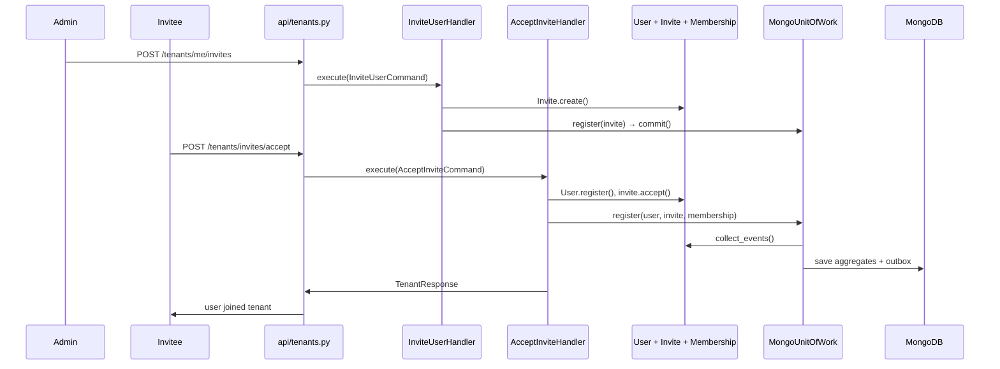

# Identity Platform — Hexagonal Architecture Presentation

Bilingual PPT outline (10 slides) and speaker script for explaining hexagonal purity in `pacific-identity-platform`.

**Estimated duration:** 8–10 minutes  
**Related docs:** [ADR-003](adr/003-hexagonal-architecture.md) · [README](../../README.md) · [EVENT_CONTRACT.md](EVENT_CONTRACT.md)

---

## PPT Outline (10 Slides)

### Slide 1 — Title

**Title:** Identity Platform — Hexagonal Architecture & Purity  
**Subtitle:** 业务在内，技术在外 / Business at the core, technology at the edges

**Visual:** Hexagon diagram + repo name

**Bullets:**
- IAM microservice: authentication, authorization, tenants, users
- Hexagonal Architecture + DDD bounded context
- Stack: FastAPI · MongoDB · Redis Streams · RS256 JWT

---

### Slide 2 — The One-Liner

**中文：**
> 业务规则在中间；HTTP、MongoDB、JWT、Redis 在边缘当可替换插件；**依赖永远从外向内**。

**English:**
> Business rules live in the center; HTTP, MongoDB, JWT, and Redis are replaceable adapters at the edge; **dependencies always point inward**.

**Visual:** Core (Domain + Application) surrounded by four adapters

---

### Slide 3 — What Hexagonal Purity Means

**Core idea:** Not folder names — **dependency direction**

| Inner | Defines ports (what I need) |
|-------|-----------------------------|
| Outer | Implements adapters (how it's done) |

**Rule:** Outer → Inner ✅ · Inner → Outer ❌

**Visual:** Dependency diagram

```mermaid
flowchart TB
  subgraph outer [Adapters — replaceable technology]
    API[FastAPI / api/]
    Mongo[MongoDB / Beanie]
    JWT[JWT / security]
    Redis[Redis Streams / outbox]
  end

  subgraph core [Core — business]
    App[Application — use cases]
    Dom[Domain — business rules]
  end

  API --> App
  App --> Dom
  Mongo --> Dom
  JWT --> App
  Redis --> Dom

  Dom -.->|never| API
  Dom -.->|never| Mongo
  App -.->|never| Mongo
  App -.->|never| JWT impl
```

**Purity =** the core does not know HTTP status codes, Mongo document shapes, or JWT library details.

---

### Slide 4 — Four Layers

| Layer | Directory | Does | Does NOT |
|-------|-----------|------|----------|
| **Domain** | `domain/` | Entities, rules, events, repository interfaces | Import FastAPI / Beanie / Mongo |
| **Application** | `application/` | Command/Query handlers, orchestration | Touch DB or JWT implementations |
| **Infrastructure** | `infrastructure/` | Mongo repos, JWT, outbox, Redis | Business rules |
| **API** | `api/` + `main.py` | HTTP parsing, exception → status mapping | `tenant.suspend()` logic |

**Visual:** Layer pyramid + directory tree snapshot

README phrase **"Dependencies always point inward"** refers to this model.

---

### Slide 5 — Five Verifiable Proofs (1/2)

**① Domain is framework-free** — `Tenant.suspend()` only mutates state and `_record(event)`

**② Ports inside, adapters outside** — `UserRepository`, `TokenService`, `EventPublisher`

**③ Application does not import infrastructure** — enforced by `test_phase1_boundaries.py`

**Visual:** Code snippets — `tenant.suspend`, repository port, boundary test

---

### Slide 6 — Five Verifiable Proofs (2/2)

**④ API is a thin adapter** — `DomainError` → HTTP status only in `main.py`

**⑤ Persistence separation** — `Tenant` entity ↔ `TenantDocument` ↔ mappers

**Recent polish (landed):**
- `SharedKernelPort` — application no longer imports `src.shared.*` directly
- `ensure_default_tenant` — aligned with UoW + outbox path
- `UserDTO` — transport-neutral names in application; HTTP aliases in `schemas/`

**Visual:** Exception handler + entity vs document comparison

---

### Slide 7 — End-to-End Example: Add User to Existing Tenant

**Scenario:** Admin invites a colleague; invitee accepts and joins the tenant (two command handlers, one UoW path on accept).

**Flow:**
```
Step 1 — Admin creates invite
POST /tenants/me/invites
  → InviteUserHandler
  → Invite.create()  (_record InviteCreated)
  → UnitOfWork.commit()

Step 2 — Invitee joins tenant (user creation)
POST /tenants/invites/accept
  → AcceptInviteHandler
  → User.register() + invite.accept()
  → UnitOfWork: user + invite + membership
  → UnitOfWork.commit()  (UserRegistered, InviteAccepted, UserAddedToTenant → outbox)
  → OutboxRelayWorker → Redis Streams (production)
```

**Visual:** Sequence diagram (focus on accept step)



**Talking point:** Business says "add this person to my tenant atomically"; Mongo implements via UoW + outbox — connected by the `UnitOfWork` port without leaking either way.

---

### Slide 8 — Events: Outbox Inside, Redis Outside

**Internal:** Command Handler + Outbox binds DB writes and event emission

**External:** `EVENT_TRANSPORT=redis_streams` → `XADD` to `identity:events`

**Subscribe:** Identity publishes only; Tracking consumes via `XREADGROUP` (not in this repo)

**Visual:**
```
OutboxRelayWorker
      │
      ▼
EventPublisher.publish()
      ├── InProcessEventPublisher  →  handler(event)     [same process]
      └── RedisStreamsPublisher    →  XADD identity:events
                                              │
                                              ▼
                                    Tracking XREADGROUP  [external]
```

See [EVENT_CONTRACT.md](EVENT_CONTRACT.md) for full catalog.

---

### Slide 9 — vs Traditional Three-Tier & Value

| Traditional three-tier | Hexagonal (this repo) |
|------------------------|------------------------|
| Service imports `UserDoc` | Handler knows `User` entity only |
| `HTTPException(409)` in business | `DuplicateEmail()` domain exception |
| JWT scattered in services | `TokenService` port + infra adapter |
| Swap DB → touch many services | Swap DB → mainly `infrastructure/persistence/` |

**Value:** testable core · swappable technology · clear boundaries

---

### Slide 10 — Evidence & Close

**Evidence:**
1. [ADR-003](adr/003-hexagonal-architecture.md)
2. Boundary tests — `backend/tests/test_phase1_boundaries.py` (53 pytest tests pass)
3. Directory layout — `domain/` → `application/` → `infrastructure/` + `api/`

**30-second close (bilingual below)**

**Q&A backup:** Application uses Pydantic DTOs — does not break dependency direction; framework choice, not an architecture leak.

---

## Appendix — Code References for Slides

### Domain purity — `Tenant.suspend()`

```53:59:backend/src/domain/entities/tenant.py
    def suspend(self, reason: str | None = None) -> None:
        if self.status == TenantStatus.SUSPENDED:
            raise TenantAlreadySuspended()
        self.status = TenantStatus.SUSPENDED
        self.is_active = False
        self.suspended_at = now_hk()
        self._record(TenantSuspended(tenant_id=self.id, reason=reason))
```

### Boundary translation — `main.py`

```110:116:backend/src/main.py
@app.exception_handler(DomainError)
async def domain_error_handler(_request: Request, exc: DomainError) -> JSONResponse:
    status_code = _DOMAIN_STATUS.get(type(exc), status.HTTP_400_BAD_REQUEST)
    return JSONResponse(
        status_code=status_code,
        content={"detail": str(exc) or type(exc).__name__},
    )
```

### UoW + outbox — `accept_invite.py`

```97:106:backend/src/application/commands/accept_invite.py
        async with self._uow:
            self._uow.register(user)
            self._uow.register(invite)
            await self._membership_service.ensure_membership(
                tenant_id=tenant.id,
                user_id=user.id,
                role=role,
                uow=self._uow,
            )
            await self._uow.commit()
```

